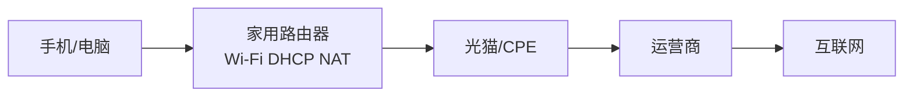
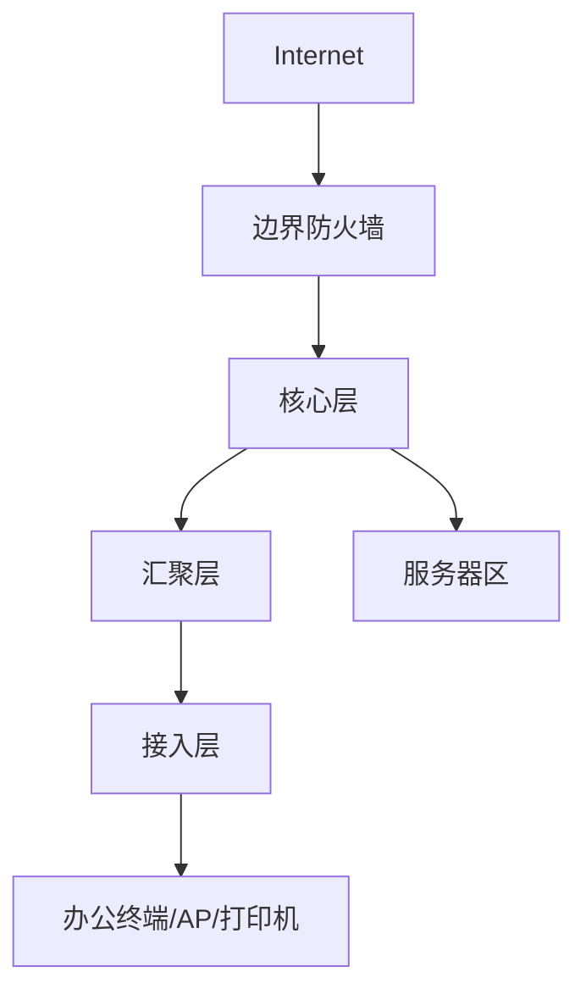
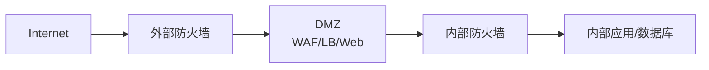
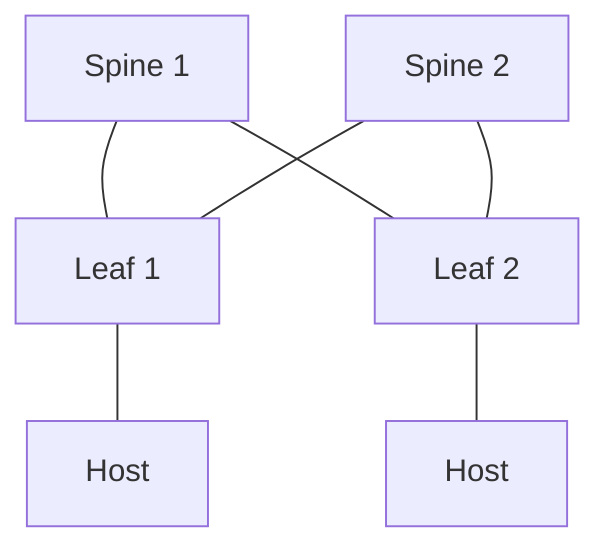
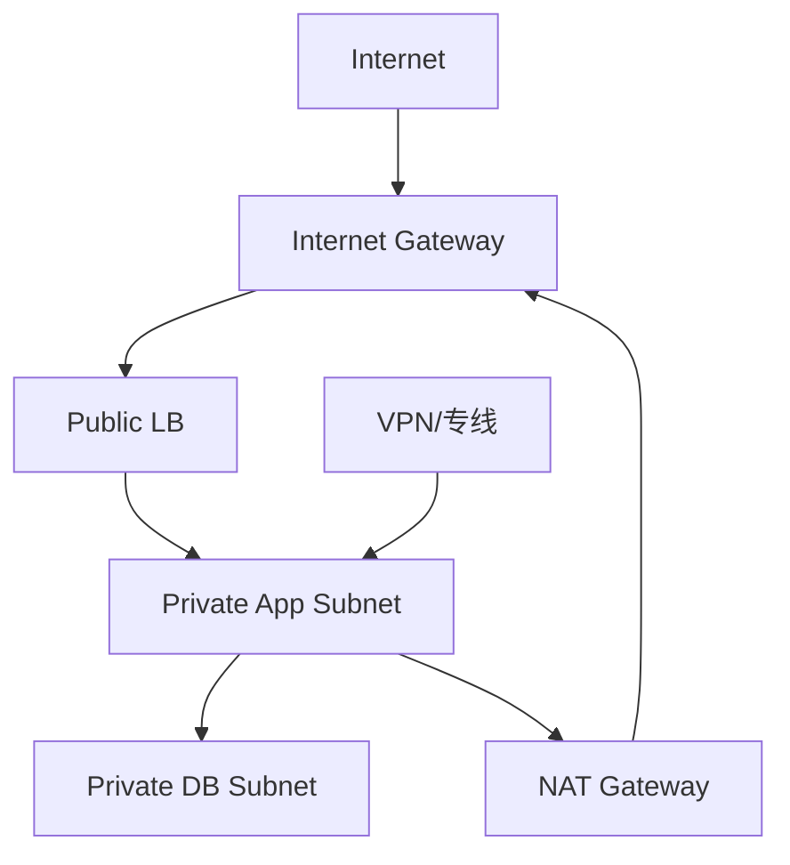
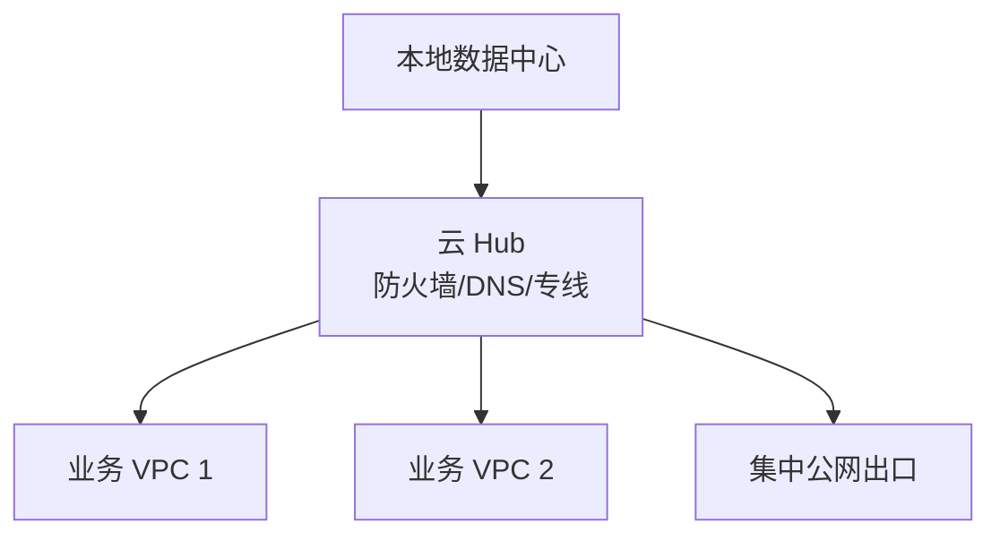
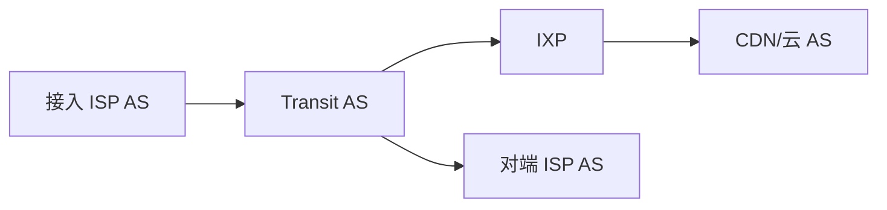

# 拓扑图模板与速查

这篇用于快速识别常见网络拓扑。读拓扑图时先确认：节点是什么、线代表什么、边界在哪里、路由在哪里、NAT 和安全策略在哪里发生。

## 家庭/SOHO

关键词：DHCP、NAT、Wi-Fi、CGNAT、IPv6、防火墙。

## 企业园区

关键词：VLAN、STP/LACP、三层网关、OSPF、ACL、出口 NAT。

## DMZ

关键词：公网发布、DNAT、WAF、反向代理、最小权限。

## Spine-Leaf

关键词：ECMP、Underlay、VXLAN、EVPN、东西向流量。

## 公有云 VPC

关键词：子网、路由表、NAT Gateway、安全组、负载均衡、专线/VPN。

## 混合云 Hub-Spoke

关键词：Transit、BGP、地址规划、回程路由、共享服务。

## 互联网 AS

关键词：ASN、BGP、Peering、Transit、IXP、Anycast。

## 关联

- [[网络拓扑知识地图]]
- [[网络拓扑类型总览]]
- [[端到端实例：局域网到公网再到对端局域网]]

