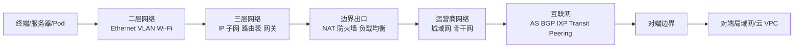

# 网络拓扑知识地图

更新时间：2026-06-14

这张图是整个库的入口。网络拓扑不是单一主题，而是“设备如何连接、地址如何规划、路由如何选择、流量如何被转发、安全设备如何插入、云平台如何抽象网络”的组合。

## 先建立全局图景

## 推荐阅读顺序

1. [[从零学习路线图]]
2. [[OSI 与 TCP-IP 分层模型]]
3. [[二层网络与三层网络]]
4. [[IP 地址、子网与 CIDR]]
5. [[局域网基础拓扑]]
6. [[互联网宏观拓扑]]
7. [[自治系统 AS 与 ASN]]
8. [[BGP 边界网关协议]]
9. [[公有云 VPC 通用拓扑]]
10. [[端到端实例：局域网到公网再到对端局域网]]

## 按主题进入

### 基础模型

- [[OSI 与 TCP-IP 分层模型]]
- [[封装、解封装与 MTU]]
- [[二层网络与三层网络]]
- [[IP 地址、子网与 CIDR]]
- [[路由表、RIB 与 FIB]]
- [[默认网关与下一跳]]

### 拓扑类型

- [[网络拓扑类型总览]]
- [[拓扑图模板与速查]]
- [[星型、树型、环型、网状拓扑]]
- [[园区网三层架构]]
- [[传统数据中心三层拓扑]]
- [[Spine-Leaf 数据中心拓扑]]
- [[Overlay 与 Underlay]]
- [[WAN、MPLS 与 SD-WAN]]
- [[互联网宏观拓扑]]
- [[CDN 与边缘节点拓扑]]
- [[DMZ 边界网络拓扑]]

### 局域网、出口与安全

- [[家庭与小型办公室 SOHO 拓扑]]
- [[VLAN 与 Trunk]]
- [[STP 与二层环路]]
- [[链路聚合 LACP]]
- [[高可用网关 VRRP-HSRP]]
- [[无线局域网 WLAN 拓扑]]
- [[NAT、PAT 与 CGNAT]]
- [[防火墙、ACL 与安全域]]
- [[负载均衡 L4-L7]]
- [[DNS、GSLB 与 Anycast 调度]]
- [[零信任、SASE 与 ZTNA]]
- [[地址规划与 IPAM]]

### 云网络

- [[公有云 VPC 通用拓扑]]
- [[AWS VPC 拓扑要点]]
- [[Azure VNet 拓扑要点]]
- [[Google Cloud VPC 拓扑要点]]
- [[私有云与 OpenStack Neutron 拓扑]]
- [[Kubernetes 网络拓扑]]
- [[混合云、专线与 VPN]]
- [[多云互联拓扑]]

### 路由协议

- [[路由协议总览]]
- [[OSPF 开放最短路径优先]]
- [[IS-IS 路由协议]]
- [[BGP 边界网关协议]]
- [[静态路由、默认路由与策略路由]]
- [[ECMP 与等价多路径]]
- [[VRF 与网络隔离]]
- [[路由重分发、汇总与过滤]]
- [[BGP 安全、RPKI 与路由泄漏]]
- [[组播与 PIM 概览]]

### 协议速查

- [[Ethernet 以太网]]
- [[ARP 与 IPv6 NDP]]
- [[IPv4 协议]]
- [[IPv6 协议]]
- [[ICMP 与故障诊断]]
- [[TCP、UDP 与 QUIC]]
- [[DNS 协议]]
- [[DHCP 协议]]
- [[TLS、HTTP 与 HTTPS]]
- [[IPsec、WireGuard 与隧道]]
- [[VXLAN 与 EVPN]]

## 重要理解

- 拓扑图上的“线”不等于一根真实网线。它可能是光纤链路、运营商二层专线、MPLS LSP、VPN 隧道、VXLAN Overlay、云平台虚拟转发路径。
- “内网到公网”不是简单地从 A 走到 B，通常会经历 DNS、ARP/NDP、路由选择、NAT、ACL/防火墙、负载均衡、BGP 选路、TLS、应用层网关等过程。
- 公有云里的 VPC/VNet 看起来像传统局域网，但它通常是软件定义网络，不一定有你能登录的物理交换机或路由器。
- 互联网不是一个中心化网络，而是大量 [[自治系统 AS 与 ASN]] 通过 [[BGP 边界网关协议]] 交换可达性形成的网络之网。
