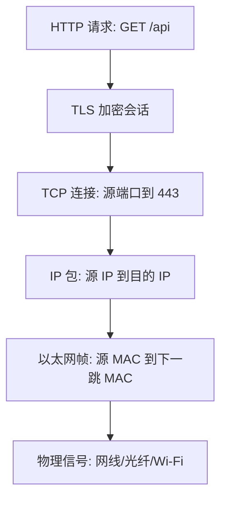

# OSI 与 TCP-IP 分层模型

## 核心概念

分层模型用来把复杂网络拆成多个职责清晰的层。真实网络不会严格按教科书边界运行，但分层能帮助你定位问题：是线缆/Wi-Fi 问题，还是交换、路由、传输、加密、应用问题。

## OSI 七层

| 层级 | 名称 | 常见对象 | 新手理解 |
|---|---|---|---|
| L7 | 应用层 | HTTP、DNS、SMTP、API | 业务语义 |
| L6 | 表示层 | 编码、压缩、部分加密概念 | 数据格式 |
| L5 | 会话层 | 会话管理、认证上下文 | 会话状态 |
| L4 | 传输层 | TCP、UDP、QUIC | 端口、连接、可靠性 |
| L3 | 网络层 | IPv4、IPv6、ICMP、路由器 | 跨网段寻址和转发 |
| L2 | 数据链路层 | Ethernet、Wi-Fi、VLAN、ARP 所在环境 | 同一链路内转发 |
| L1 | 物理层 | 网线、光纤、无线信号 | 比特如何传出去 |

## TCP-IP 常用四层/五层

| TCP-IP | 对应 OSI | 例子 |
|---|---|---|
| 应用层 | L5-L7 | HTTP、DNS、TLS 上层使用方式 |
| 传输层 | L4 | TCP、UDP、QUIC |
| 网络层 | L3 | IP、ICMP、路由 |
| 链路层 | L2 | Ethernet、Wi-Fi、VLAN |
| 物理层 | L1 | 光、电、无线 |

## 一条 HTTPS 请求的分层视角

注意：以太网帧的目的 MAC 通常是“下一跳”的 MAC，不一定是最终服务器的 MAC；IP 目的地址才通常保持为最终目的 IP，除非中途发生 NAT。

## 排障思路

- L1：接口是否 up、光模块/网线是否正常、无线信号是否差。
- L2：MAC 学习是否正确、VLAN 是否一致、是否有环路或 STP 阻塞。
- L3：IP/掩码/网关是否正确、路由表是否有路径、ACL 是否拦截。
- L4：端口是否监听、三次握手是否完成、UDP 是否被限速或丢弃。
- L7：域名、证书、HTTP 状态码、应用认证、反向代理规则。

## 关联

- [[封装、解封装与 MTU]]
- [[二层网络与三层网络]]
- [[TCP、UDP 与 QUIC]]
- [[TLS、HTTP 与 HTTPS]]

