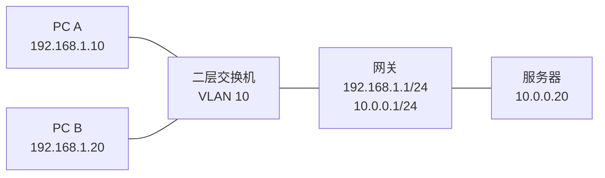

# 二层网络与三层网络

## 一句话

二层网络负责“同一链路/广播域里怎么找到对方”，三层网络负责“不同网段之间怎么走到对方”。

## 二层网络 L2

二层使用 MAC 地址转发帧。交换机会学习“某个 MAC 地址在哪个端口后面”，然后把以太网帧转发到对应端口。

常见二层概念：

- MAC 地址
- Ethernet 帧
- 交换机
- VLAN
- Trunk
- STP
- 广播域
- ARP 所依赖的本地二层广播

同一个 VLAN、同一个 IP 子网中的主机，通常可以通过二层直接通信，不需要路由器转发。

## 三层网络 L3

三层使用 IP 地址转发包。路由器或三层交换机会查看目的 IP，与路由表匹配，选择下一跳。

常见三层概念：

- IPv4/IPv6 地址
- 子网掩码/CIDR
- 默认网关
- 路由表
- 静态路由
- OSPF、IS-IS、BGP
- ACL、防火墙策略

## 本地通信与跨网段通信

主机发送数据时会先判断目的 IP 是否在本地子网：

- 如果在本地子网：用 ARP/NDP 找目的主机 MAC。
- 如果不在本地子网：用 ARP/NDP 找默认网关 MAC，把帧发给网关。

注意：跨网段时，以太网帧的目的 MAC 是网关 MAC，而 IP 包的目的 IP 仍然是最终目的 IP。

## 图示

PC A 到 PC B：二层交换即可。

PC A 到服务器：先发给网关，再由网关三层转发。

## 常见误区

- “交换机只工作在二层”不总是对。三层交换机可以做路由。
- “VLAN 等于子网”不严格对。常见设计是一 VLAN 一子网，但 VLAN 是二层概念，子网是三层概念。
- “MAC 地址能跨互联网找到服务器”不对。MAC 只在当前二层链路逐跳有效。

## 关联

- [[VLAN 与 Trunk]]
- [[默认网关与下一跳]]
- [[ARP 与 IPv6 NDP]]
- [[路由表、RIB 与 FIB]]

