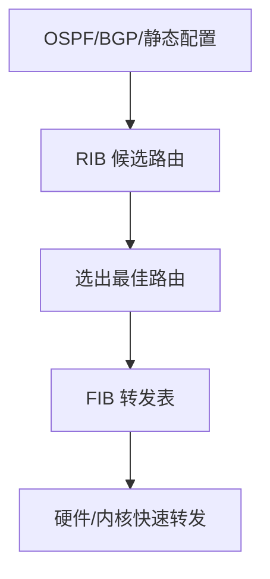

# 路由表、RIB 与 FIB

## 核心概念

路由器不是凭感觉转发包，而是查表。常见有三类相关表：

| 名称 | 含义 | 作用 |
|---|---|---|
| RIB | Routing Information Base | 控制平面收集到的候选路由 |
| FIB | Forwarding Information Base | 真正用于快速转发的表 |
| 邻接表 | 下一跳到二层封装的信息 | 知道下一跳 MAC/出接口 |

## 路由来源

路由表中的路由可能来自：

- 直连路由：接口配置 IP 后自动产生。
- 静态路由：管理员手工配置。
- 动态路由：OSPF、IS-IS、BGP 等协议学习。
- 云平台系统路由：VPC/VNet 自动生成。
- 策略路由：根据源地址、端口、标记等条件选择路径。

## 路由选择顺序

不同厂商细节不同，但一般会考虑：

1. 最长前缀匹配。
2. 管理距离或路由优先级。
3. 协议内部度量值。
4. ECMP 是否允许多条等价路径。

最长前缀匹配最重要。更具体的路由通常优先于默认路由。

## 控制平面与数据平面

控制平面负责学习和计算；数据平面负责高速转发。

## 云里的路由表

云 VPC/VNet 的路由表看起来像传统路由表，但下一跳可能是云资源：

- local / Virtual network
- Internet Gateway
- NAT Gateway
- Transit Gateway / Virtual WAN / Cloud Router
- VPN Gateway
- Firewall Appliance
- Load Balancer

## 排障要点

- 查目的地址是否匹配到预期路由。
- 查回程路由是否对称或被允许。
- 查路由传播是否打开。
- 查更具体路由是否覆盖了默认路由。
- 查安全组、防火墙、NACL 是否在路由之后拦截。

## 关联

- [[默认网关与下一跳]]
- [[路由协议总览]]
- [[ECMP 与等价多路径]]
- [[公有云 VPC 通用拓扑]]

