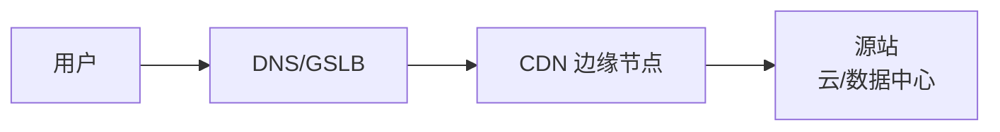

# CDN 与边缘节点拓扑

## CDN 是什么

CDN 把内容缓存或代理到靠近用户的边缘节点，减少回源距离、提升访问速度，并吸收部分流量冲击。

## 基本拓扑



## 请求路径

缓存命中：

```text
用户 -> CDN 边缘 -> 直接返回
```

缓存未命中：

```text
用户 -> CDN 边缘 -> 回源 -> 源站返回 -> 边缘缓存 -> 用户
```

## 调度方式

- DNS 返回不同边缘节点 IP。
- Anycast 把同一 IP 引到不同边缘。
- 边缘内部再根据负载选择服务器。
- 回源可能走公网、专线或云厂商骨干。

## CDN 能处理什么

- 静态文件缓存。
- 图片/视频分发。
- HTTPS 证书和 TLS 终止。
- DDoS 缓解。
- WAF。
- 动态加速。
- 边缘函数。

## 关键风险

- 源站真实 IP 暴露后，攻击可能绕过 CDN。
- 缓存策略错误导致用户看到旧数据。
- 动态接口误缓存造成数据泄露。
- 客户端真实 IP 需要通过 Header 或代理协议传递。
- 回源安全策略需要只允许 CDN 节点或专用链路。

## 关联

- [[DNS、GSLB 与 Anycast 调度]]
- [[BGP 边界网关协议]]
- [[代理、反向代理与 WAF]]
- [[负载均衡 L4-L7]]

