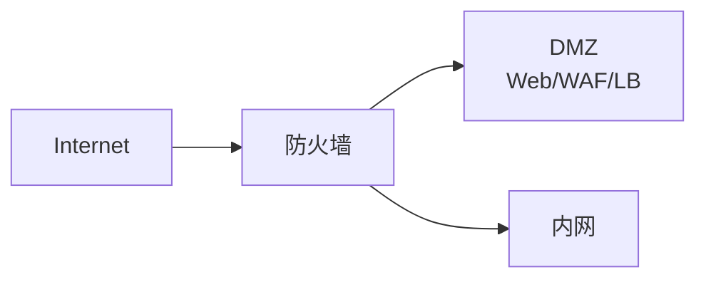

# DMZ 边界网络拓扑

## DMZ 是什么

DMZ 是放置对外服务的隔离区。它的目标是让公网用户能访问必要服务，同时降低这些服务被攻破后直接进入内网的风险。

## 单防火墙三接口

特点：

- 成本较低。
- 策略集中。
- 防火墙是关键单点，通常需要 HA。

## 双防火墙

特点：

- 外部与内部边界分开。
- 安全层次更清晰。
- 成本和运维复杂度更高。

## 常见放置对象

- WAF。
- 反向代理。
- 公网负载均衡。
- Web 前端。
- VPN 网关。
- 邮件网关。
- DNS 权威服务器。

## 策略原则

- Internet 只能访问 DMZ 的必要端口。
- DMZ 只能访问内网必要后端。
- 内网管理 DMZ 需要堡垒机或管理网。
- DMZ 服务器不应随意主动访问互联网。
- 日志集中收集，便于审计。

## 与云的对应

云上不一定叫 DMZ，但概念类似：

- 公有子网放公网 LB/WAF/NAT。
- 私有子网放应用和数据库。
- 安全组、NACL、云防火墙控制路径。

## 关联

- [[防火墙、ACL 与安全域]]
- [[代理、反向代理与 WAF]]
- [[公有云 VPC 通用拓扑]]
- [[端到端实例：局域网到公网再到对端局域网]]

