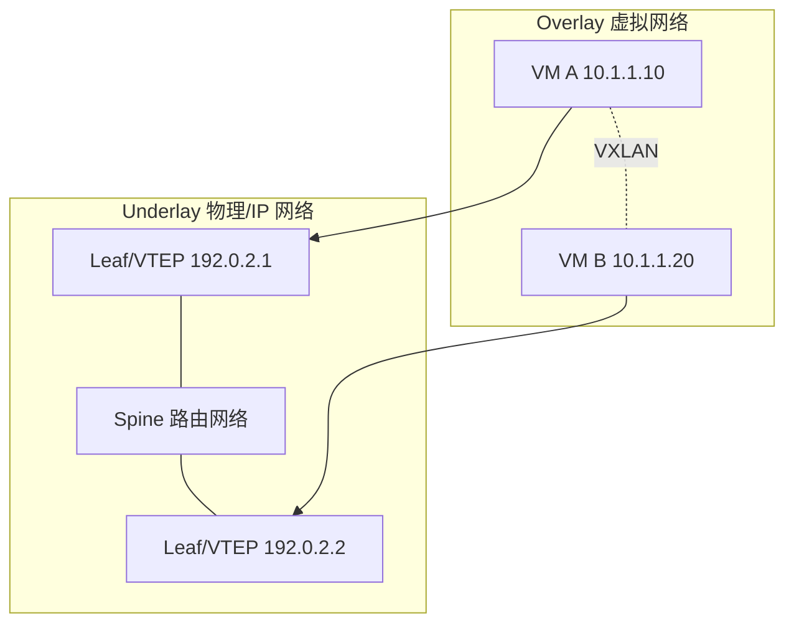

# Overlay 与 Underlay

## 一句话

Underlay 是真实承载网络，Overlay 是叠加在其上的虚拟网络。

## 图示

## Underlay 负责什么

- 物理连通性。
- IP 可达性。
- 链路冗余和 ECMP。
- 基础 MTU、QoS、故障收敛。

常见 Underlay 协议：OSPF、IS-IS、BGP、静态路由。

## Overlay 负责什么

- 多租户隔离。
- 虚拟二层/三层网络。
- 跨机架、跨区域的逻辑连接。
- 与云平台、虚拟化平台、容器平台集成。

常见 Overlay 技术：VXLAN、GRE、Geneve、IPsec、WireGuard、SD-WAN 隧道。

## 为什么需要 Overlay

物理网络改动成本高，而业务需要快速创建网络、迁移虚拟机、隔离租户。Overlay 让逻辑网络可以通过软件创建，不必每次都改物理交换机。

## 代价

- 额外封装导致 MTU 开销。
- 排障更复杂，需要同时看内层和外层。
- 流量可观测性下降，传统抓包只能看到隧道外层。
- 控制平面如果设计不好，会出现黑洞、重复学习或漂移。

## 关联

- [[Spine-Leaf 数据中心拓扑]]
- [[VXLAN 与 EVPN]]
- [[公有云 VPC 通用拓扑]]
- [[Kubernetes 网络拓扑]]

