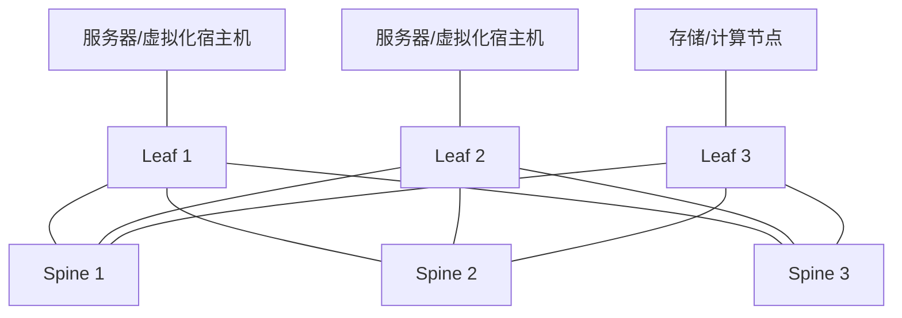

# Spine-Leaf 数据中心拓扑

## 核心概念

Spine-Leaf 是现代数据中心常见拓扑。每台 Leaf 交换机连接所有 Spine 交换机，服务器连接 Leaf。任意两台服务器之间通常经过：

```text
服务器 -> Leaf -> Spine -> Leaf -> 服务器
```

## 拓扑图



## 为什么用 Spine-Leaf

传统三层架构更适合南北向流量，即终端访问数据中心或互联网。数据中心内部虚拟机、容器、微服务之间大量通信，这叫东西向流量。Spine-Leaf 提供更可预测的东西向路径和带宽。

## 关键特性

- 任意 Leaf 到任意 Leaf 跳数一致。
- 通过增加 Spine 横向扩展带宽。
- 常用 ECMP 分担多条路径。
- 常和 [[VXLAN 与 EVPN]] 搭配，实现跨机架二层/三层虚拟网络。

## 常见协议组合

| 层面 | 常见选择 |
|---|---|
| Underlay | BGP、OSPF、IS-IS |
| Overlay 数据面 | VXLAN |
| Overlay 控制面 | EVPN BGP |
| 负载分担 | ECMP |

## 常见误区

- Spine-Leaf 不等于必须二层大网。现代设计通常 Underlay 是三层。
- VXLAN 不是魔法，它只是把二层帧封装进三层网络，底层 IP 仍然要稳定。
- Spine 不应该接服务器，通常只负责 Leaf 间转发。

## 关联

- [[Overlay 与 Underlay]]
- [[VXLAN 与 EVPN]]
- [[ECMP 与等价多路径]]
- [[BGP 边界网关协议]]

