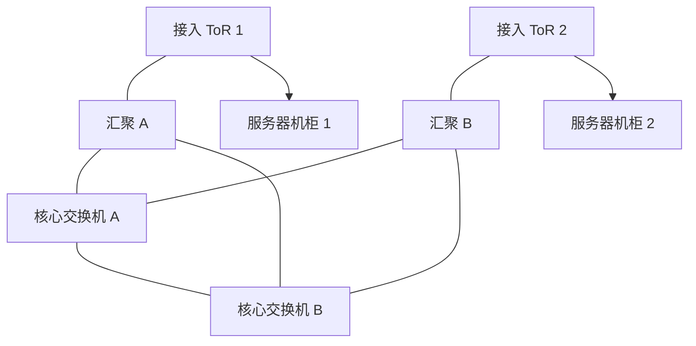

# 传统数据中心三层拓扑

## 核心概念

传统数据中心常采用核心、汇聚、接入三层结构。服务器连接接入交换机，接入上联汇聚，汇聚再上联核心。

## 拓扑

## 典型职责

- 接入层：服务器接入、VLAN、端口安全、链路聚合。
- 汇聚层：三层网关、防火墙插入、服务模块、路由汇总。
- 核心层：高速互联、连接园区/出口/广域网。

## 优点

- 层次清楚。
- 适合南北向流量较多的传统业务。
- 和传统防火墙、负载均衡、存储网络集成成熟。

## 局限

- 东西向流量可能绕行汇聚/核心。
- 二层域扩大后 STP 风险和故障域变大。
- 横向扩容不如 Spine-Leaf 自然。
- 虚拟机迁移和多租户网络需要额外设计。

## 与 Spine-Leaf 对比

| 项目 | 三层数据中心 | Spine-Leaf |
|---|---|---|
| 主要流量模型 | 南北向 | 东西向和南北向 |
| 扩展方式 | 纵向增强核心/汇聚 | 增加 Spine/Leaf |
| 跳数 | 不一定一致 | 通常更一致 |
| Overlay | 可选 | 常见 |

## 关联

- [[Spine-Leaf 数据中心拓扑]]
- [[园区网三层架构]]
- [[链路聚合 LACP]]
- [[防火墙、ACL 与安全域]]

