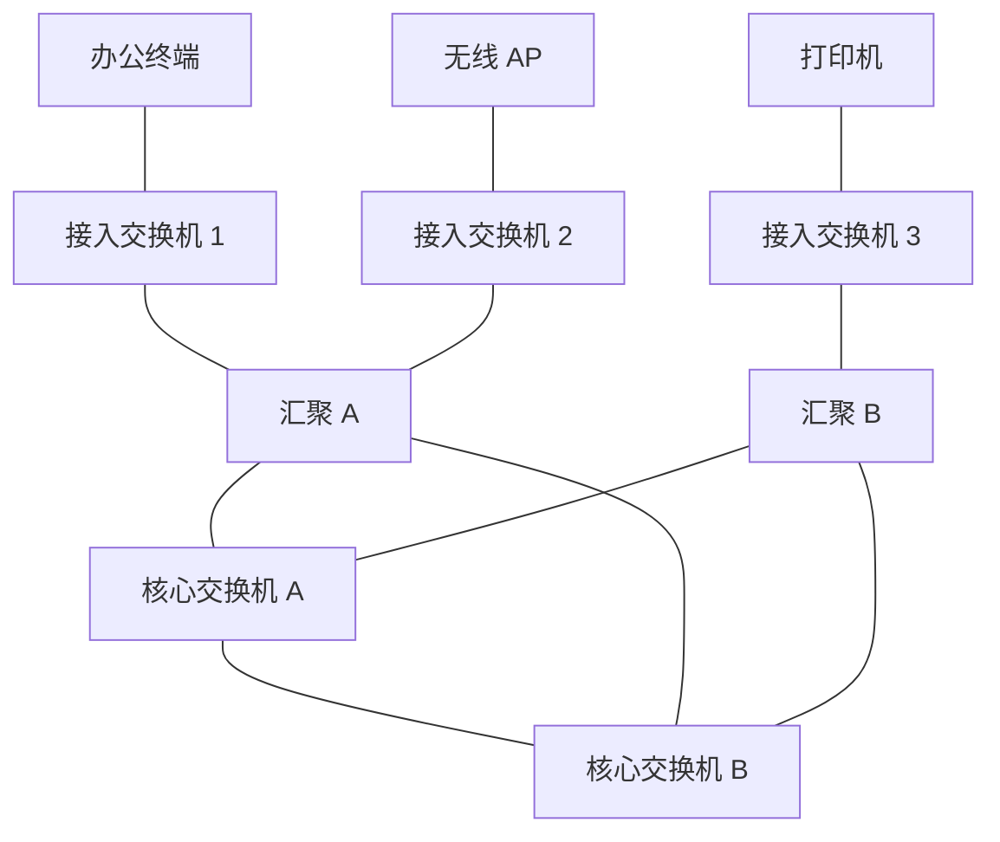

# 园区网三层架构

## 核心概念

园区网通常服务于办公楼、学校、工厂、医院等区域。经典模型分为三层：

- 接入层：终端接入。
- 汇聚层：策略、聚合、三层网关。
- 核心层：高速转发和区域互联。

## 典型拓扑

## 每层职责

| 层 | 职责 | 常见功能 |
|---|---|---|
| 接入层 | 接终端 | VLAN、PoE、802.1X、端口安全 |
| 汇聚层 | 聚合和控制 | SVI 网关、ACL、OSPF、策略路由 |
| 核心层 | 快速转发 | 高带宽、低策略、冗余路由 |

## 二层到汇聚，还是三层到接入

传统设计常把二层 VLAN 延伸到汇聚层，由汇聚层做网关。现代大型园区越来越倾向三层下沉到接入层，减少二层故障域。

二层到汇聚：

- 优点：终端漫游和 VLAN 管理简单。
- 缺点：广播域大，STP/环路风险更高。

三层到接入：

- 优点：故障域小，路由收敛清晰。
- 缺点：地址和路由规划更复杂。

## 常见出口

园区网通常连接到：

- 数据中心区
- 互联网出口防火墙
- VPN/专线
- 无线控制器或云管平台
- NAC/认证系统

## 关联

- [[VLAN 与 Trunk]]
- [[STP 与二层环路]]
- [[OSPF 开放最短路径优先]]
- [[防火墙、ACL 与安全域]]

