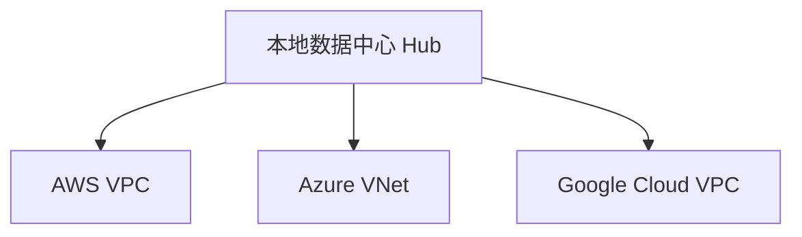
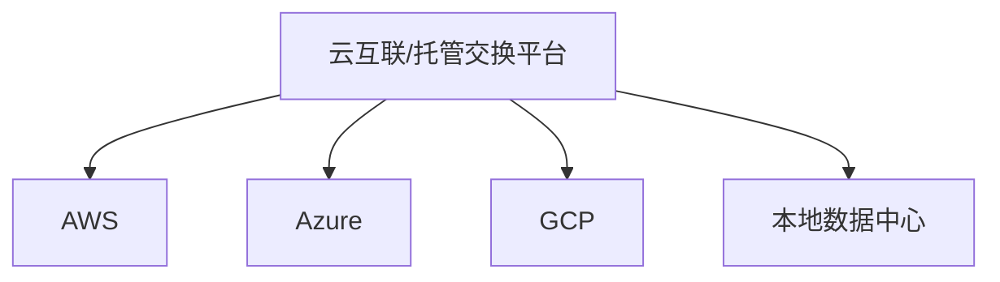
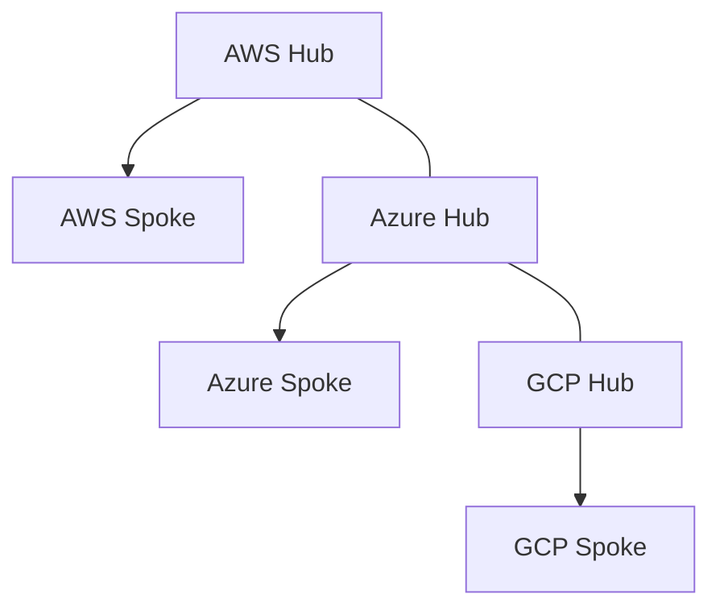

# 多云互联拓扑

## 多云是什么

多云是同一组织同时使用多个公有云或云与 SaaS/私有云组合。多云互联要解决路由、地址、安全、DNS、身份和运维一致性。

## 常见拓扑

### 本地数据中心作为中心

优点：集中管控。缺点：云间互访可能绕本地。

### 云中立互联中心

优点：云间路径更直接。缺点：依赖第三方或托管机房。

### 每朵云 Hub-Spoke

## 关键设计点

- 全局地址规划，避免 VPC/VNet CIDR 重叠。
- BGP 路由控制，避免路由环路。
- 云间 DNS 解析和私有域转发。
- 统一出口与分布式出口取舍。
- 安全检查点是否集中。
- 日志与流量可观测性跨云统一。

## 常见问题

- 云 Peering 不传递路由，导致“间接互通”失败。
- 一朵云的私有服务端点不能跨 Peering 或跨云使用。
- DNS 解析成公网地址，绕过私网。
- 安全组/防火墙只配置单向。
- NAT 解决地址重叠后，审计和回包变复杂。

## 关联

- [[混合云、专线与 VPN]]
- [[公有云 VPC 通用拓扑]]
- [[BGP 边界网关协议]]
- [[地址规划与 IPAM]]

