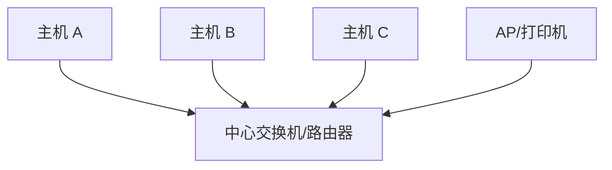
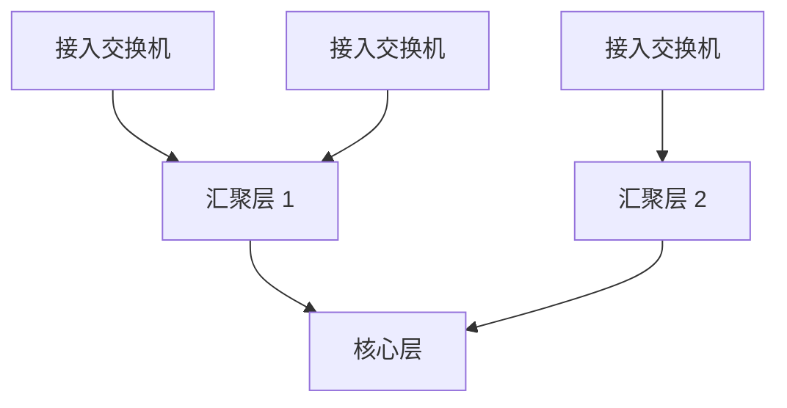

# 星型、树型、环型、网状拓扑

## 星型拓扑



优点：

- 简单，适合小型网络。
- 单个终端故障不影响其他终端。
- 易于管理。

缺点：

- 中心设备是单点。
- 扩展到大规模时中心端口和性能成为瓶颈。

## 树型拓扑



树型拓扑常见于企业园区网。它通过核心、汇聚、接入分层管理网络。

优点：

- 层次清晰。
- 易于按楼层、部门、区域扩展。

缺点：

- 上层链路可能成为瓶颈。
- 二层树型需要 STP 或类似机制避免环路。

## 环型拓扑

环型常见于城域传输、工业以太网、运营商接入。每个节点连相邻节点，形成闭环。

优点：

- 一段链路断开时可以反向绕行。
- 光纤资源利用较好。

缺点：

- 协议收敛和环路控制要求高。
- 故障定位可能比星型复杂。

## 网状拓扑

全网状：

```text
N 个节点之间尽量两两互连
```

部分网状：

```text
关键节点多链路互联，普通节点只连几个上游
```

优点：

- 冗余好。
- 多路径选择能力强。

缺点：

- 线路和端口成本高。
- 路由策略复杂。

## 关联

- [[网络拓扑类型总览]]
- [[园区网三层架构]]
- [[WAN、MPLS 与 SD-WAN]]
- [[ECMP 与等价多路径]]

