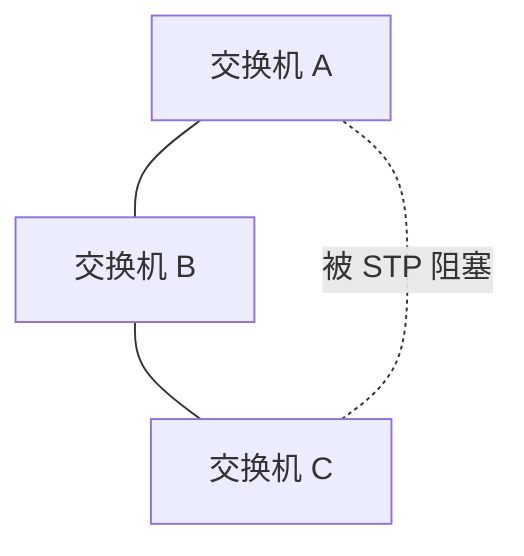

# STP 与二层环路

## 二层环路为什么危险

二层以太网没有像 IP TTL 那样的天然递减字段。如果交换网络中存在环路，广播帧、未知单播帧可能不断循环，造成广播风暴。

后果：

- 交换机 CPU 升高。
- MAC 表反复抖动。
- 终端无法正常通信。
- 整个 VLAN 甚至整个园区网瘫痪。

## STP 的作用

STP（生成树协议）通过阻塞部分链路，让物理上有冗余的二层网络在逻辑上形成无环树。

链路故障时，STP 可以重新计算，让被阻塞链路转发。

## 常见版本

- STP：原始版本，收敛慢。
- RSTP：快速生成树，收敛更快。
- MSTP：多生成树，可按 VLAN 组计算。
- 厂商增强：PVST、Rapid-PVST 等。

## 防护机制

- BPDU Guard：边缘端口收到 BPDU 就关闭，防止误接交换机。
- Root Guard：防止非预期交换机成为根桥。
- Loop Guard：防止单向链路导致环路。
- Storm Control：限制广播/组播/未知单播风暴。

## 现代替代方向

大型数据中心倾向三层到接入、Spine-Leaf、VXLAN EVPN，减少大二层依赖。

## 关联

- [[VLAN 与 Trunk]]
- [[园区网三层架构]]
- [[Spine-Leaf 数据中心拓扑]]
- [[Overlay 与 Underlay]]

