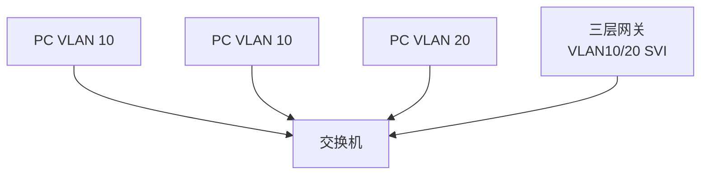

# VLAN 与 Trunk

## VLAN 是什么

VLAN 是在二层交换网络中划分广播域的技术。不同 VLAN 默认不能二层互通，需要三层网关路由。

PC1 和 PC2 同 VLAN，可以二层通信。PC1 和 PC3 不同 VLAN，需要经过三层网关。

## Access 口与 Trunk 口

| 端口类型 | 用途 |
|---|---|
| Access | 接普通终端，只属于一个 VLAN |
| Trunk | 交换机之间、交换机到虚拟化宿主机/AP，承载多个 VLAN |

Trunk 常用 802.1Q 标签区分 VLAN。

## VLAN 与子网

常见设计是一 VLAN 一子网：

| VLAN | 子网 | 用途 |
|---|---|---|
| VLAN 10 | 10.10.10.0/24 | 办公网 |
| VLAN 20 | 10.10.20.0/24 | 服务器网 |
| VLAN 30 | 10.10.30.0/24 | 访客网 |

但 VLAN 是二层概念，子网是三层概念。它们不应混淆。

## Inter-VLAN Routing

不同 VLAN 互通需要三层设备：

- 三层交换机 SVI。
- 路由器子接口。
- 防火墙子接口。
- 云平台虚拟路由。

如果不同安全等级的 VLAN 要互通，通常放到防火墙做策略控制。

## 常见问题

- Trunk 允许 VLAN 列表漏配。
- Native VLAN 不一致。
- AP/虚拟化宿主机需要多个 VLAN 但端口配置成 Access。
- VLAN 只隔离广播域，不代表访问控制已经完成。

## 关联

- [[二层网络与三层网络]]
- [[STP 与二层环路]]
- [[防火墙、ACL 与安全域]]
- [[园区网三层架构]]

