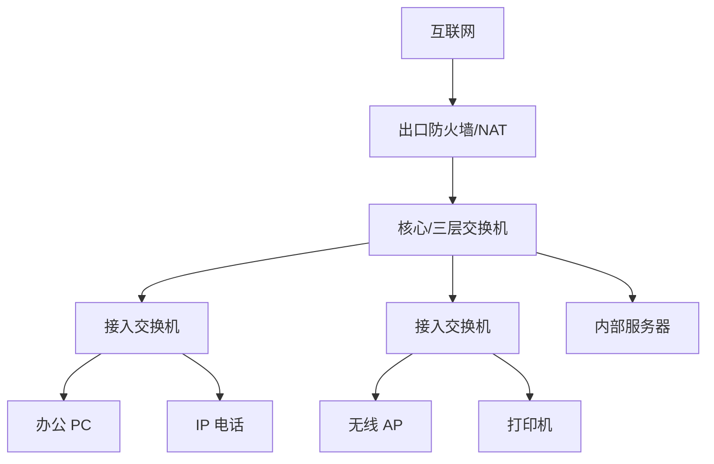

# 局域网基础拓扑

## 局域网是什么

局域网 LAN 是一个相对小范围内的网络，例如家庭、办公室、机房、楼层。它通常由交换机、无线 AP、路由器、防火墙和终端组成。

## 典型办公局域网

## 常见网络区域

| 区域 | 说明 |
|---|---|
| 办公网 | 员工电脑、打印机、电话 |
| 无线员工网 | 员工移动设备 |
| 访客网 | 只允许访问互联网 |
| 服务器区 | 内部业务系统 |
| 管理网 | 交换机、防火墙、服务器管理接口 |
| DMZ | 对外提供服务的隔离区 |

## 常见协议

- DHCP：给终端发 IP、网关、DNS。
- ARP/NDP：找到本地下一跳 MAC。
- DNS：解析域名。
- STP：防止二层环路。
- OSPF/静态路由：三层互联。
- NAT：访问互联网。
- 802.1X：接入认证。

## 局域网到公网的关键路径

1. 终端拿到地址。
2. DNS 解析目标域名。
3. 判断目标不在本地子网。
4. 发给默认网关。
5. 防火墙检查策略。
6. 出口设备做 NAT。
7. 转发给运营商。

## 关联

- [[VLAN 与 Trunk]]
- [[DHCP 协议]]
- [[NAT、PAT 与 CGNAT]]
- [[端到端实例：局域网到公网再到对端局域网]]

