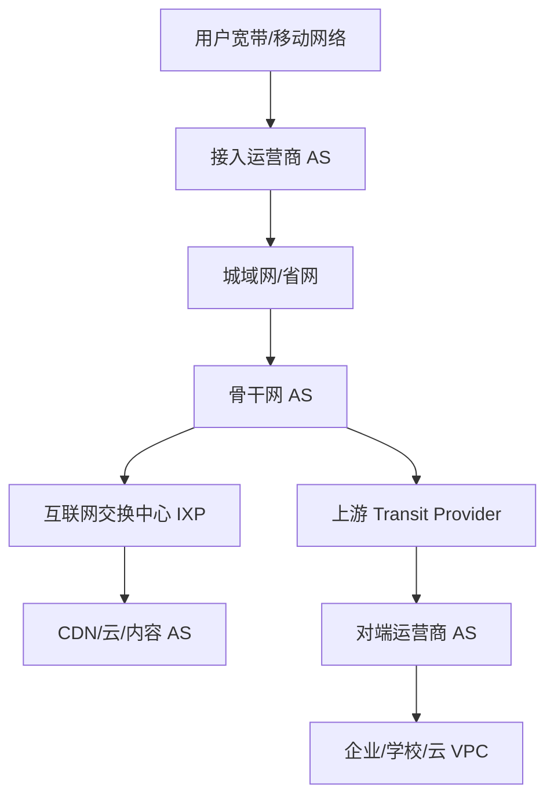

# 互联网宏观拓扑

## 互联网不是一个中心网络

互联网是大量自治系统 AS 互联形成的网络之网。每个 AS 由一个组织控制，例如运营商、云厂商、大学、大企业、CDN、内容平台。

AS 之间通过 [[BGP 边界网关协议]] 交换“哪些 IP 前缀可以通过我到达”的信息。

## 宏观结构

## AS 关系

常见关系：

- Customer-Provider：客户付费给上游，购买互联网可达性。
- Peer-Peer：两个网络互相交换各自和客户流量，通常不互相转发上游流量。
- Sibling/Internal：同一组织内部多个 AS。

这些关系会影响 BGP 策略，所以互联网路径不一定是最短物理路径。

## IXP

IXP 是多个网络互联交换流量的地点或平台。通过 IXP，两个网络可以直接 Peer，减少绕路和上游费用。

## CDN 与边缘

CDN 把内容缓存到靠近用户的节点。用户访问同一个域名时，DNS/GSLB/Anycast 可能把用户调度到不同城市或运营商内的节点。

## 互联网路径为什么会变

- BGP 路由策略变化。
- 链路故障或维护。
- DDoS 清洗牵引。
- CDN 调度策略变化。
- 运营商互联拥塞。
- DNS 缓存和解析器位置不同。

## 关联

- [[自治系统 AS 与 ASN]]
- [[IXP、Peering 与 Transit]]
- [[BGP 边界网关协议]]
- [[DNS、GSLB 与 Anycast 调度]]

