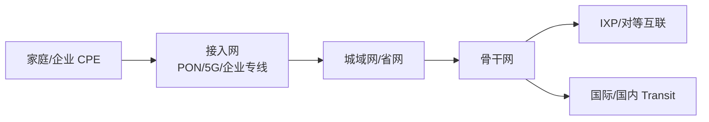

# 运营商接入网、城域网与骨干网

## 分层视角

用户访问公网时，通常先进入接入网，再进入城域网/省网，再进入骨干网或互联点。

## 接入网

接入网连接最终用户：

- 家庭宽带：PON/以太网/同轴等。
- 移动网络：4G/5G 基站、核心网。
- 企业专线：以太专线、MSTP、OTN、MPLS VPN、互联网专线。

## 城域网

城域网汇聚城市内大量用户和企业流量，连接本地机房、BRAS/BNG、移动核心网、CDN 缓存、云接入点。

## 骨干网

骨干网连接不同城市、省份、国家或大区。它关注高带宽、高可靠、快速恢复和路由策略。

## 用户公网出口

用户可能获得：

- 独享公网 IPv4。
- 动态公网 IPv4。
- CGNAT 后的私网地址。
- IPv6 前缀。
- 企业 BGP 多线接入。

## 常见影响

- 同城 CDN 命中时，流量可能不进远端骨干。
- 跨运营商访问可能受互联质量影响。
- 国际访问受国际出口、海缆、策略和拥塞影响。
- 移动网络可能经过运营商核心网和 NAT。

## 关联

- [[NAT、PAT 与 CGNAT]]
- [[互联网宏观拓扑]]
- [[IXP、Peering 与 Transit]]
- [[BGP 边界网关协议]]

