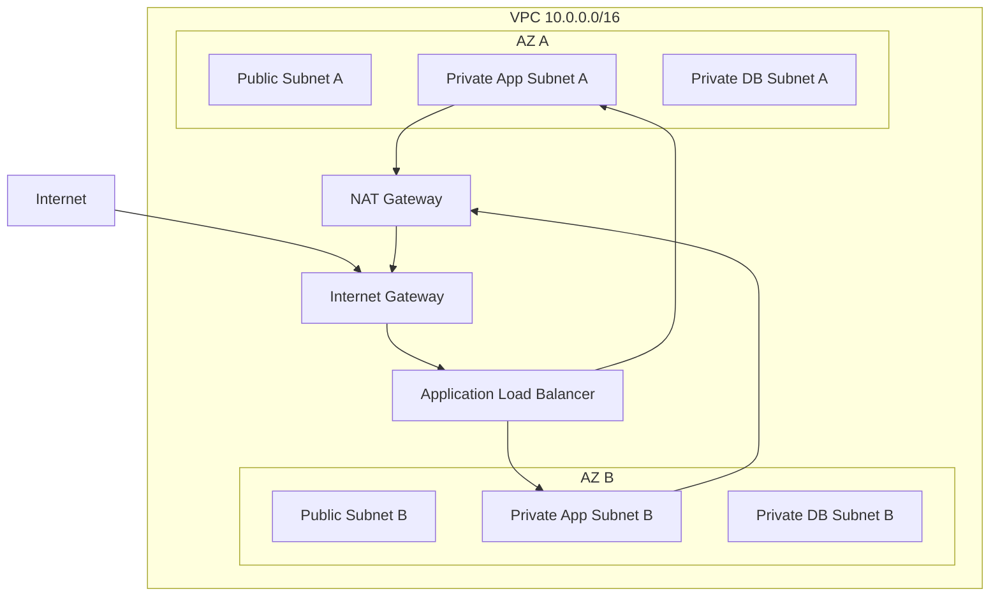

# AWS VPC 拓扑要点

## 基础结构

AWS VPC 是区域级资源，子网属于某个可用区。常见设计是在多个 AZ 中创建同类型子网，提高可用性。

## 路由表

每个子网关联一张路由表。路由表包含本地路由和自定义路由。

常见路由：

| 目的 | 目标 |
|---|---|
| VPC CIDR | local |
| 0.0.0.0/0 | Internet Gateway |
| 0.0.0.0/0 | NAT Gateway |
| 对端 VPC CIDR | VPC Peering / Transit Gateway |
| 本地机房 CIDR | Virtual Private Gateway / Transit Gateway |

## Internet Gateway

Internet Gateway 给 VPC 提供互联网路由目标。实例要直接公网通信，通常还需要公网 IPv4 或 IPv6 地址，以及安全组/NACL 放行。

## NAT Gateway

NAT Gateway 常放在公有子网，让私有子网中的实例主动访问互联网。它不允许互联网主动发起连接到私有实例。

## 安全组与 NACL

- Security Group：状态防火墙，绑定实例/网卡，常用。
- NACL：子网级无状态规则，需要同时考虑入站和出站。

## 常见设计

- 多 AZ 公有负载均衡 + 私有应用子网 + 私有数据库子网。
- 每个 AZ 放一个 NAT Gateway，避免跨 AZ 依赖和流量费用。
- 多 VPC 用 Transit Gateway 做中心互联。
- 入口前加 WAF，出口前加 Network Firewall 或代理。

## 关联

- [[公有云 VPC 通用拓扑]]
- [[NAT、PAT 与 CGNAT]]
- [[负载均衡 L4-L7]]
- [[混合云、专线与 VPN]]

