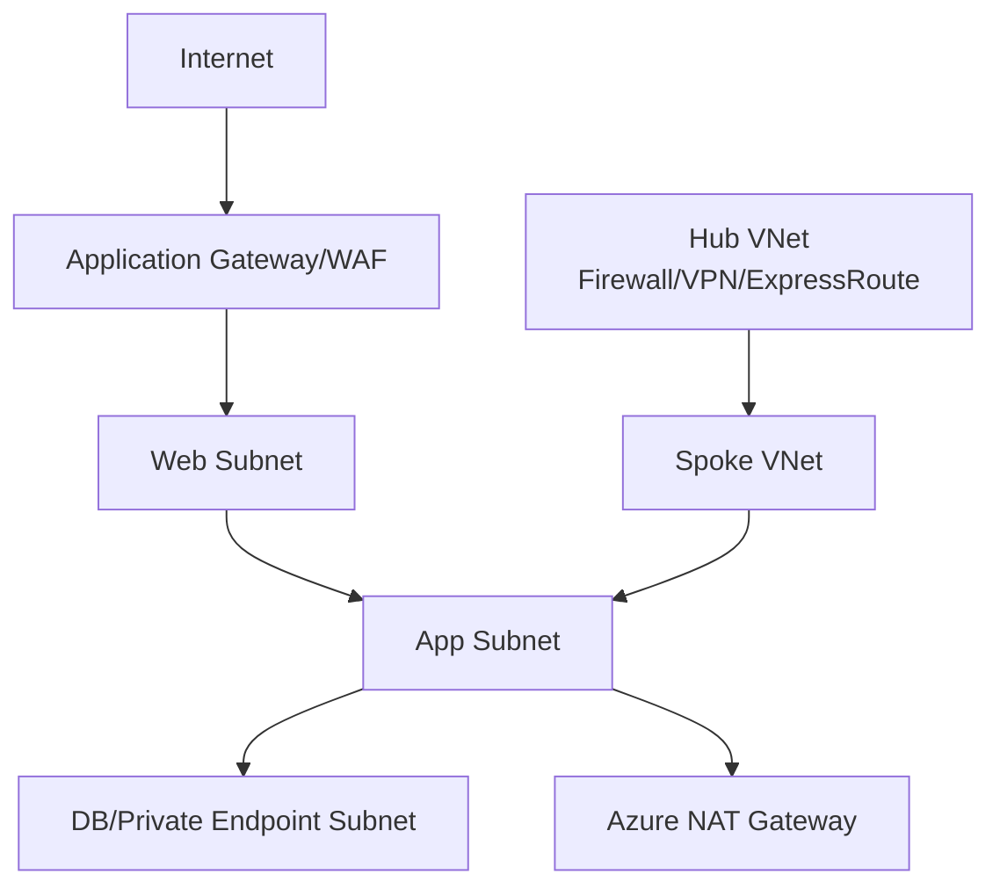

# Azure VNet 拓扑要点

## 基础结构

Azure VNet 是 Azure 的虚拟网络。VNet 包含子网，子网内放 VM、应用网关、私有终结点、AKS 节点等资源。

## 系统路由与用户定义路由

Azure 会为每个子网自动创建系统路由。你可以用 UDR（User Defined Route）覆盖或引导流量，例如把默认路由指向 Azure Firewall/NVA。

## NAT Gateway

Azure NAT Gateway 在子网级提供出站公网连接。资源无需直接公网 IP，也可以通过 NAT Gateway 主动访问互联网。

## Hub-Spoke

Azure 常见企业拓扑是 Hub-Spoke：

- Hub：Azure Firewall、VPN Gateway、ExpressRoute Gateway、DNS、共享服务。
- Spoke：业务 VNet。
- VNet Peering：连接 Hub 和 Spoke。

## 安全组件

- NSG：网络安全组，可绑定子网或网卡。
- Azure Firewall：集中防火墙。
- Application Gateway/WAF：七层入口。
- Private Endpoint：私有访问 PaaS 服务。

## 常见注意点

- UDR 和系统路由优先级要理解清楚。
- Peering 不是传递路由，复杂组网常需要 Virtual WAN、NVA 或路由服务。
- ExpressRoute/VPN 与防火墙结合时要特别关注回程路径。

## 关联

- [[公有云 VPC 通用拓扑]]
- [[防火墙、ACL 与安全域]]
- [[混合云、专线与 VPN]]
- [[负载均衡 L4-L7]]

