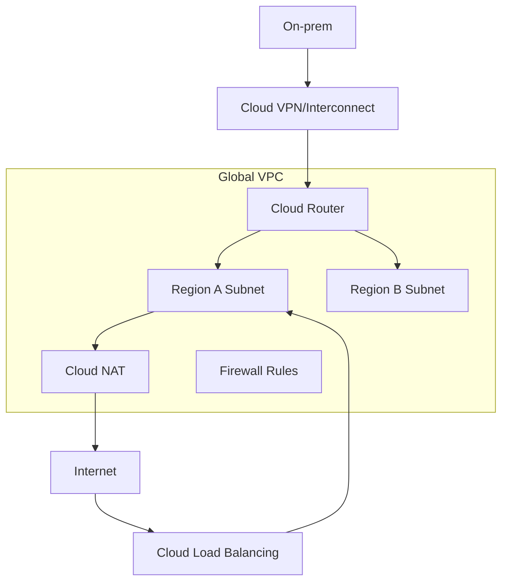

# Google Cloud VPC 拓扑要点

## 基础结构

Google Cloud VPC 是全局资源，子网是区域资源。这一点和很多“VPC 区域级、子网可用区级”的云不同。

## 路由

Google Cloud VPC 路由是虚拟化、分布式的。常见路由类型包括：

- 子网路由。
- 静态路由。
- 动态路由，由 Cloud Router 通过 BGP 学习。
- Policy-based routes。
- Peering routes。

## Cloud NAT

Cloud NAT 让没有外部 IP 的 VM 主动访问互联网。它按区域和 VPC 配置，不能随意给所有 Peering VPC 提供 NAT。

## 防火墙

Google Cloud 防火墙规则作用于 VPC 网络，可按网络标签、服务账号、方向、优先级匹配。

## 典型设计

- Shared VPC：网络项目集中管理 VPC，服务项目部署业务。
- Cloud Load Balancing 做全球入口。
- Cloud Router + Cloud VPN/Interconnect 连接本地。
- 私有 Google 访问和 Private Service Connect 连接云服务。

## 关联

- [[公有云 VPC 通用拓扑]]
- [[混合云、专线与 VPN]]
- [[BGP 边界网关协议]]
- [[负载均衡 L4-L7]]

