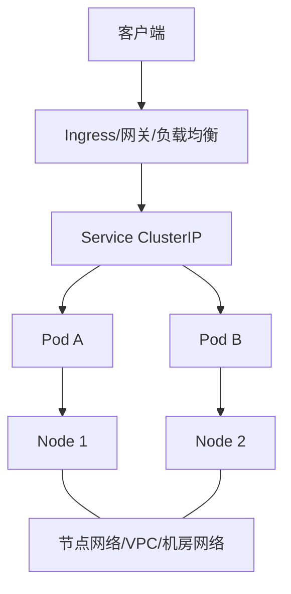

# Kubernetes 网络拓扑

## Kubernetes 网络模型

Kubernetes 假设：

- 每个 Pod 有自己的 IP。
- Pod 之间可以直接通信，不需要 NAT。
- Node 上的组件可以和所有 Pod 通信。
- Service 提供稳定虚拟入口。

真实实现由 CNI 插件完成，例如 Calico、Cilium、Flannel、Antrea、云厂商 CNI。

## 基本拓扑

## 关键对象

| 对象 | 作用 |
|---|---|
| Pod IP | Pod 的网络身份 |
| Node IP | 节点的网络身份 |
| Service | 稳定虚拟 IP 或 DNS 名称 |
| Ingress | HTTP/HTTPS 七层入口规则 |
| Gateway API | 新一代入口/流量 API |
| NetworkPolicy | Pod 间访问控制 |
| CNI | 实现 Pod 网络的插件 |

## Pod 到 Pod

可能有两种实现：

- 路由模式：底层网络知道 Pod CIDR，直接路由。
- Overlay 模式：Pod 包被封装进 VXLAN/Geneve/IPIP 等隧道。

## Service

Service 不是一个真实主机，而是稳定访问抽象。kube-proxy 或 eBPF 数据平面会把访问 Service IP 的流量转到后端 Pod。

## Ingress

Ingress 常用于 HTTP/HTTPS 入口，通常由 Ingress Controller 实现，例如 NGINX、Traefik、HAProxy、云负载均衡控制器。它可以做 TLS 终止、路径转发、域名虚拟主机。

## NetworkPolicy

NetworkPolicy 控制 Pod 之间允许哪些入站/出站连接。它是否生效取决于 CNI 插件是否支持。

## 常见排障

- Pod 能否解析 DNS。
- Service 是否有 Endpoints/EndpointSlice。
- NetworkPolicy 是否拦截。
- CNI 节点路由/隧道是否正常。
- 云安全组/防火墙是否允许 NodePort/LoadBalancer。
- MTU 是否因 Overlay 变小。

## 关联

- [[Overlay 与 Underlay]]
- [[VXLAN 与 EVPN]]
- [[负载均衡 L4-L7]]
- [[DNS 协议]]

