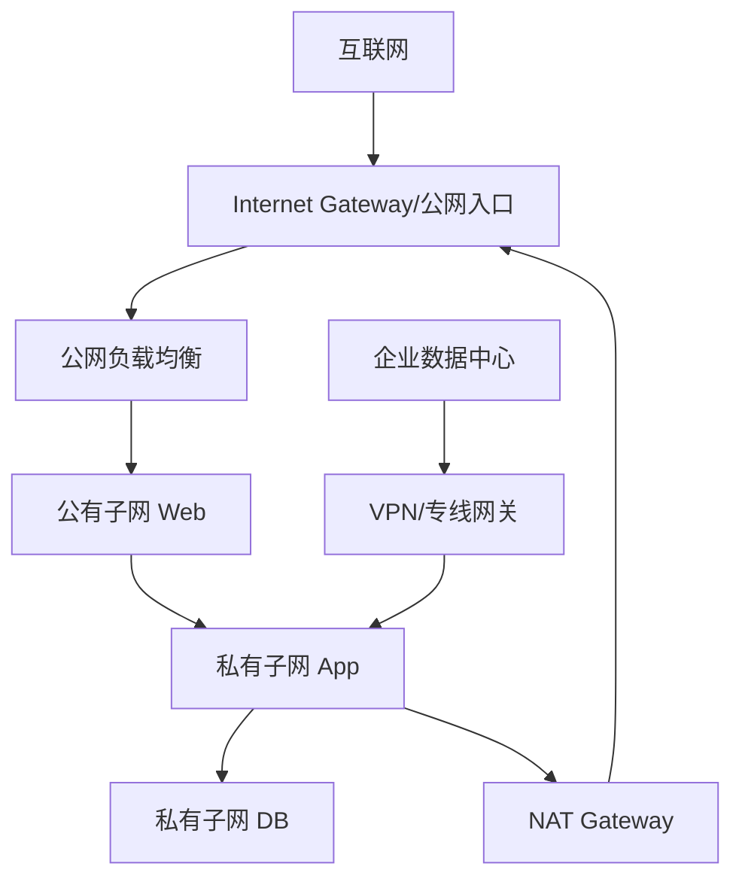

# 公有云 VPC 通用拓扑

## VPC 是什么

VPC 是公有云提供的逻辑隔离网络。它让你在云里创建类似私有数据中心的网络：子网、路由表、网关、安全组、负载均衡、NAT、VPN/专线等。

不同云厂商名称不同：

- AWS：VPC
- Azure：VNet
- Google Cloud：VPC network

## 典型三层云拓扑

## 核心组件

| 组件 | 作用 |
|---|---|
| VPC/VNet | 逻辑私有网络边界 |
| Subnet | IP 地址范围，通常绑定可用区/区域 |
| Route Table | 决定子网流量下一跳 |
| Internet Gateway | 公网入/出口能力 |
| NAT Gateway | 私有实例主动访问公网 |
| Security Group | 实例/网卡级状态防火墙 |
| NACL | 子网级无状态过滤，部分云提供 |
| Load Balancer | 暴露服务、分发流量 |
| VPN/专线 | 连接本地数据中心或其他云 |

## 公有子网与私有子网

公有子网通常满足：

- 路由表有默认路由指向 Internet Gateway。
- 资源有公网 IP 或经公网负载均衡暴露。

私有子网通常满足：

- 没有直接公网入站路径。
- 出公网经 NAT Gateway 或代理。
- 入站来自负载均衡、堡垒机、VPN、专线或其他私网。

## 南北向与东西向

- 南北向：互联网/本地数据中心 到 云内服务。
- 东西向：云内服务之间互访，例如 Web 到 App、App 到 DB、Pod 到 Pod。

云安全设计不应只管入口，还要管东西向横向移动。

## 常见拓扑模式

- 单 VPC 多子网。
- 多 VPC Peering。
- Hub-Spoke：共享出口、安全检查、专线集中在 Hub。
- Transit 网关：多 VPC、多站点路由中心。
- 多区域容灾：DNS/GSLB/Anycast 调度到不同区域。

## 关联

- [[AWS VPC 拓扑要点]]
- [[Azure VNet 拓扑要点]]
- [[Google Cloud VPC 拓扑要点]]
- [[混合云、专线与 VPN]]
- [[负载均衡 L4-L7]]

