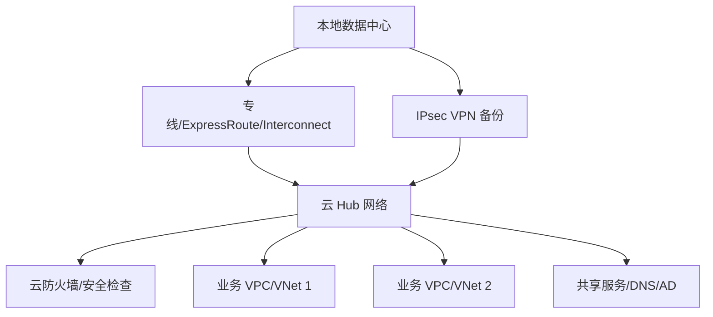

# 混合云、专线与 VPN

## 混合云是什么

混合云把本地数据中心、办公室、私有云、公有云 VPC/VNet 连接成一个整体。

## 典型 Hub-Spoke 混合云

## 连接方式

| 方式 | 特点 |
|---|---|
| IPsec VPN | 成本低、开通快、走公网、带宽和稳定性受公网影响 |
| 专线 | 稳定、可 SLA、成本高、开通周期较长 |
| SD-WAN | 统一管理多链路，可按应用选路 |
| 云互联服务 | 通过云厂商骨干连接多个 VPC/VNet 或区域 |

## 路由方式

- 静态路由：简单但人工维护多。
- BGP 动态路由：适合专线/VPN 多路径和大规模网络。
- 路由传播：云网关自动把路由传给路由表。
- 策略路由：强制某类流量经过防火墙或代理。

## 关键问题

- 地址是否重叠：重叠网段会让路由不可判定。
- 回程是否一致：有状态防火墙要求流量往返经过同一检查点。
- DNS 如何解析：云内私有域、本地域、跨云域如何互转。
- 出口在哪里：互联网出口集中在本地、云 Hub，还是各 Spoke 本地。
- 加密要求：专线是否仍需应用层或隧道加密。

## 常见故障

- 本地能去云，云不能回本地：回程路由缺失。
- VPN 建立但业务不通：安全策略、感兴趣流、路由、NACL 不一致。
- 云到云跨 Peering 不通：Peering 不传递路由或未配置 Transit。
- DNS 解析成公网地址导致绕公网。

## 关联

- [[公有云 VPC 通用拓扑]]
- [[IPsec、WireGuard 与隧道]]
- [[BGP 边界网关协议]]
- [[静态路由、默认路由与策略路由]]

