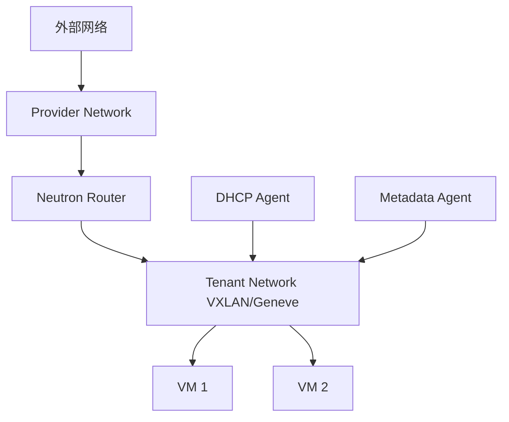

# 私有云与 OpenStack Neutron 拓扑

## 私有云网络是什么

私有云把虚拟化、计算、存储、网络能力部署在企业自己的机房或托管机房中。常见平台包括 OpenStack、VMware、裸金属云、Kubernetes 私有集群。

## OpenStack Neutron 典型概念

| 概念 | 作用 |
|---|---|
| Network | 二层网络抽象 |
| Subnet | 三层地址范围和 DHCP 配置 |
| Router | 连接不同 Subnet，提供三层转发 |
| Provider Network | 映射到物理网络/VLAN |
| Self-service Network | 租户自助创建的网络，通常通过 Overlay 实现 |
| Floating IP | 把外部可达地址映射到实例 |
| Security Group | 实例级安全策略 |

## 典型拓扑

## Provider Network

Provider Network 通常直接映射到物理 VLAN 或物理网络，适合需要与现有数据中心网络直接互通的场景。

## Self-service Network

租户自助网络通常使用 Overlay。租户可以创建自己的私有网络，再通过虚拟路由器、SNAT、Floating IP 与外部通信。

## 与公有云的相似点

- 都有网络、子网、路由、安全组。
- 都可能用 Overlay 实现多租户隔离。
- 都需要处理公网入口、私网出口、东西向隔离。

## 与公有云的不同点

- 私有云需要自己维护物理网络和控制平面。
- 需要关心交换机、服务器网卡、MTU、隧道端点、控制节点高可用。
- 出问题时既要查云平台，也要查底层物理网络。

## 关联

- [[Overlay 与 Underlay]]
- [[VXLAN 与 EVPN]]
- [[公有云 VPC 通用拓扑]]
- [[Spine-Leaf 数据中心拓扑]]

