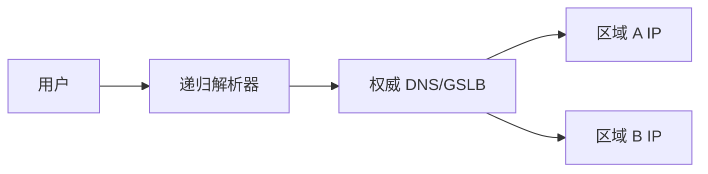
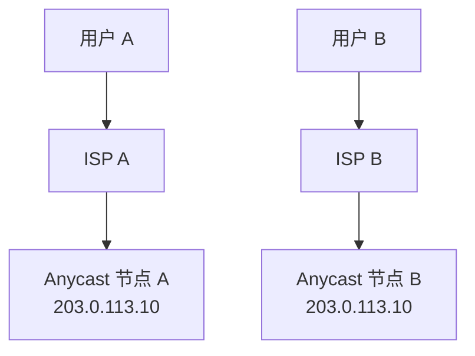

# DNS、GSLB 与 Anycast 调度

## DNS 调度

DNS 不只是把域名解析成 IP，也常用于流量调度。权威 DNS 可以根据用户来源、解析器位置、健康状态、运营商、地理位置返回不同地址。

## GSLB

GSLB（Global Server Load Balancing）是全局流量调度。常见策略：

- 就近访问。
- 按运营商调度。
- 按权重灰度。
- 故障切换。
- 按地域合规要求分流。

## DNS 调度限制

- DNS 缓存导致切换有延迟。
- 权威 DNS 看到的通常是递归解析器位置，不一定是最终用户位置。
- 客户端或运营商可能不严格遵守 TTL。
- DNS 只决定连接开始前的入口，连接建立后通常不再改变。

## Anycast

Anycast 是多个地点宣告同一个 IP 前缀，BGP 会把用户引到路由上“更优”的节点。

同一个 IP 在多个地方存在，用户到达哪个节点取决于 BGP 路由。

## CDN

CDN 常组合使用 DNS 调度和 Anycast。静态内容可能直接由边缘节点返回，动态内容回源到源站。

## 常见场景

- 公共 DNS 服务。
- CDN 边缘。
- DDoS 清洗入口。
- 全球 API 入口。

## 关联

- [[DNS 协议]]
- [[互联网宏观拓扑]]
- [[BGP 边界网关协议]]
- [[负载均衡 L4-L7]]

