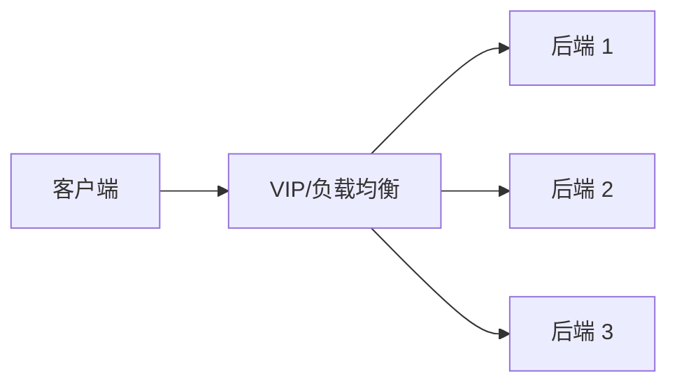

# 负载均衡 L4-L7

## 负载均衡解决什么

负载均衡把客户端流量分发到多个后端，提高容量、可用性和发布灵活性。



## L4 与 L7

| 类型 | 依据 | 适用 |
|---|---|---|
| L4 | IP、端口、协议、五元组 | TCP/UDP 通用转发，性能高 |
| L7 | HTTP Host、Path、Header、Cookie、gRPC | Web/API 路由，功能强 |

## 调度算法

- Round Robin：轮询。
- Least Connections：最少连接。
- Weighted：加权。
- Source IP Hash：同源保持。
- Consistent Hash：缓存/有状态业务常用。

## 健康检查

负载均衡需要判断后端是否健康。健康检查可以是：

- TCP 端口检查。
- HTTP 状态码检查。
- 应用自定义路径，例如 `/healthz`。

健康检查必须代表真实业务状态。只检查端口可能误判应用可用。

## TLS 终止

L7 负载均衡常在入口终止 TLS：

```text
Client --HTTPS--> LB --HTTP/HTTPS--> Backend
```

优点：

- 证书集中管理。
- 可按 Host/Path 路由。
- 可以接 WAF。

代价：

- LB 能看到明文 HTTP。
- 后端如需端到端加密，需要重新加密。

## 常见部署

- 公网 LB：对互联网暴露服务。
- 内网 LB：内部服务之间分发。
- 全局 LB：跨地域入口。
- Kubernetes Ingress/Gateway：集群入口。

## 关联

- [[DNS、GSLB 与 Anycast 调度]]
- [[TLS、HTTP 与 HTTPS]]
- [[Kubernetes 网络拓扑]]
- [[公有云 VPC 通用拓扑]]

