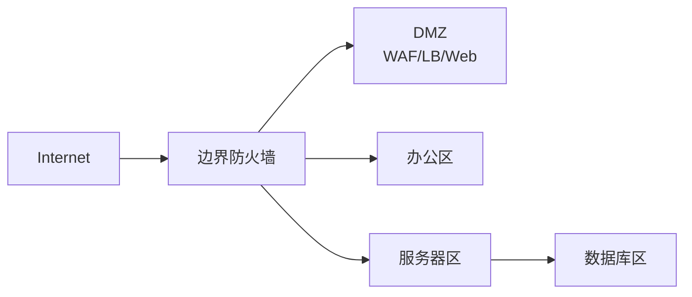

# 防火墙、ACL 与安全域

## 安全域

安全域是按信任等级划分的网络区域。常见安全域：

- Internet：不可信公网。
- DMZ：对外发布服务的缓冲区。
- Server Zone：内部服务器区。
- User Zone：办公终端区。
- Management Zone：管理网络。
- Database Zone：数据库区。

## 典型边界拓扑

## ACL 与防火墙区别

| 项目 | ACL | 防火墙 |
|---|---|---|
| 常见位置 | 路由器、交换机接口 | 边界、东西向、安全区之间 |
| 状态 | 多为无状态 | 多为有状态 |
| 匹配 | IP、端口、协议 | IP、端口、应用、用户、威胁特征 |
| 用途 | 基础过滤 | 安全策略、审计、威胁防护 |

## 有状态防火墙

有状态防火墙记录连接状态。内网主动访问公网时，回包可以因为“属于已建立连接”被允许，不需要单独开放公网到内网的入站规则。

问题：如果请求走防火墙 A，响应走防火墙 B，B 没有状态，可能丢包。这就是非对称路由常见问题。

## 云安全组

安全组通常绑定到实例/网卡，是状态防火墙。它适合精细控制实例入站/出站。

设计建议：

- 最小权限开放。
- 应用服务器只接受负载均衡或上游服务访问。
- 数据库只接受应用子网访问。
- 管理端口只允许堡垒机/VPN。

## DMZ

DMZ 用来放对外服务，例如 Web、反向代理、邮件网关、VPN 网关。DMZ 被攻破时，攻击者仍需穿过内部防火墙策略才能进入核心内网。

## 常见错误

- 为了临时排障开放 `0.0.0.0/0` 到管理端口，之后忘记收回。
- 只做边界防火墙，不做内部东西向隔离。
- NAT 映射开了，但防火墙策略未放行。
- 防火墙日志没有记录 NAT 前后地址，难以追踪。

## 关联

- [[内外网流量调度总览]]
- [[NAT、PAT 与 CGNAT]]
- [[公有云 VPC 通用拓扑]]
- [[端到端实例：局域网到公网再到对端局域网]]

