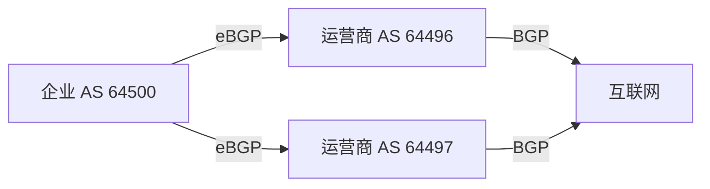

# BGP 边界网关协议

## BGP 是什么

BGP 是互联网核心路由协议。它在自治系统之间交换 IP 前缀可达性，也广泛用于大型数据中心、云网络、专线和 EVPN。

## BGP 不是单纯最短路径

BGP 是路径向量协议，重点是策略。它会携带 AS_PATH 等属性，网络管理员可以通过策略影响入站和出站流量。

## 基本拓扑

## 常见属性

| 属性 | 作用 |
|---|---|
| AS_PATH | 路径经过的 AS 列表，可防环 |
| NEXT_HOP | 下一跳地址 |
| LOCAL_PREF | 本 AS 内出站偏好 |
| MED | 给邻居参考的入口偏好 |
| Community | 给路由打标签，便于策略 |
| Origin | 路由来源类型 |

## eBGP 与 iBGP

- eBGP：不同 AS 之间。
- iBGP：同一 AS 内部。

iBGP 不会像 IGP 那样自动全网泛洪，需要 Full Mesh、Route Reflector 或 Confederation 解决扩展问题。

## BGP 选路直观顺序

不同实现细节不同，常见考虑：

1. 权重或本地厂商私有优先级。
2. LOCAL_PREF 高者优先。
3. 本地产生路由优先。
4. AS_PATH 短者优先。
5. Origin 类型。
6. MED 低者优先。
7. eBGP 优于 iBGP。
8. IGP 到 NEXT_HOP 代价低者优先。
9. 路由器 ID 等最终比较。

## 互联网中的 BGP

互联网中 BGP 负责传播公网前缀。一个错误宣告可能导致流量黑洞或劫持。现实网络会使用：

- 前缀过滤。
- AS_PATH 过滤。
- RPKI ROA 验证。
- IRR 数据库过滤。
- 最大前缀限制。

## 数据中心和云中的 BGP

BGP 也用于：

- Spine-Leaf Underlay。
- EVPN 控制平面。
- 云专线动态路由。
- Kubernetes CNI 对外宣告 Pod/Service 路由。

## 关联

- [[互联网宏观拓扑]]
- [[自治系统 AS 与 ASN]]
- [[IXP、Peering 与 Transit]]
- [[VXLAN 与 EVPN]]
- [[混合云、专线与 VPN]]

