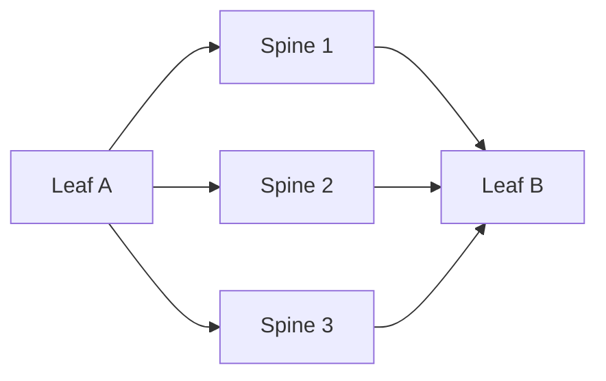

# ECMP 与等价多路径

## ECMP 是什么

ECMP（Equal-Cost Multi-Path）让路由器在多条等价路径之间分担流量。

如果三条路径代价相同，流量可以被分散到不同 Spine。

## 如何分流

ECMP 通常不是逐包轮询，而是按哈希选择路径。常见哈希字段：

- 源 IP。
- 目的 IP。
- 源端口。
- 目的端口。
- 协议。

这样同一连接通常走同一路径，避免乱序。

## 使用场景

- 数据中心 Spine-Leaf。
- 运营商骨干。
- 云 VPC 分布式转发。
- 多链路出口。
- Kubernetes/CNI BGP 路由。

## 风险

- 单条大流无法自动拆成多条路径。
- 哈希不均会造成局部拥塞。
- 回程可能走不同路径，影响有状态防火墙。
- 某些设备哈希字段少，分担效果差。

## 与负载均衡区别

ECMP 是网络层路径分担；负载均衡通常面向服务入口，把请求分到后端服务器。两者可以同时存在。

## 关联

- [[Spine-Leaf 数据中心拓扑]]
- [[路由表、RIB 与 FIB]]
- [[OSPF 开放最短路径优先]]
- [[BGP 边界网关协议]]

