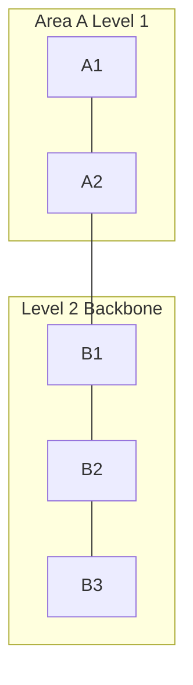

# IS-IS 路由协议

## IS-IS 是什么

IS-IS 是链路状态 IGP，常见于运营商骨干和大型网络。它和 OSPF 类似，也通过链路状态数据库计算最短路径。

## Level

IS-IS 使用 Level 区分层次：

- Level 1：区域内部。
- Level 2：区域之间骨干。
- Level 1-2：连接 L1 和 L2。

## 与 OSPF 的直观区别

| 项目 | OSPF | IS-IS |
|---|---|---|
| 层次 | Area 0 骨干 | L1/L2 层次 |
| 承载 | 运行在 IP 之上 | 直接运行在链路层之上 |
| 运营商使用 | 常见 | 非常常见 |
| 扩展性 | 好 | 大型网络中常被偏好 |

## 适用场景

- 运营商骨干。
- 大规模企业骨干。
- 数据中心 Underlay。
- Segment Routing 部署。

## 常见概念

- NET/NSAP 地址。
- LSP：链路状态 PDU。
- DIS：广播网络中的指定中间系统。
- Metric：路径度量。
- TLV：扩展信息编码方式。

## 排障点

- Level 类型不匹配。
- Area/NET 配置错误。
- 认证不一致。
- MTU 或邻接状态异常。
- 路由泄漏策略错误。

## 关联

- [[路由协议总览]]
- [[运营商接入网、城域网与骨干网]]
- [[MPLS 与 Segment Routing]]
- [[ECMP 与等价多路径]]

