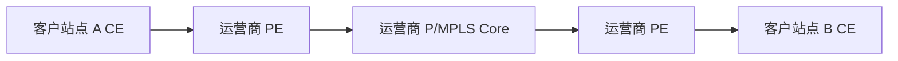

# MPLS 与 Segment Routing

## MPLS 是什么

MPLS 使用标签转发。路由器不只看 IP 目的地址，还可以根据标签把流量沿预先建立或计算出的路径转发。

## 标签栈

MPLS 包中可以有多个标签。转发设备根据顶部标签执行：

- Push：压入标签。
- Swap：替换标签。
- Pop：弹出标签。

## 常见用途

- 运营商 MPLS L3VPN。
- 流量工程。
- 快速重路由。
- 二层 VPN/VPLS。
- Segment Routing。

## MPLS L3VPN

企业购买 MPLS VPN 后，不同站点私网网段通过运营商骨干互通。运营商使用 VRF 隔离不同客户路由。

## Segment Routing

Segment Routing 把路径表示成一组 Segment。它可以运行在 MPLS 数据面，也可以运行在 IPv6 数据面（SRv6）。它常用于简化流量工程和网络切片。

## 新手理解

如果 IP 路由像“每个路口看目的地再决定下一步”，MPLS/SR 更像“包上贴了若干路径标签，路由器按标签动作转发”。

## 关联

- [[WAN、MPLS 与 SD-WAN]]
- [[IS-IS 路由协议]]
- [[BGP 边界网关协议]]
- [[混合云、专线与 VPN]]

