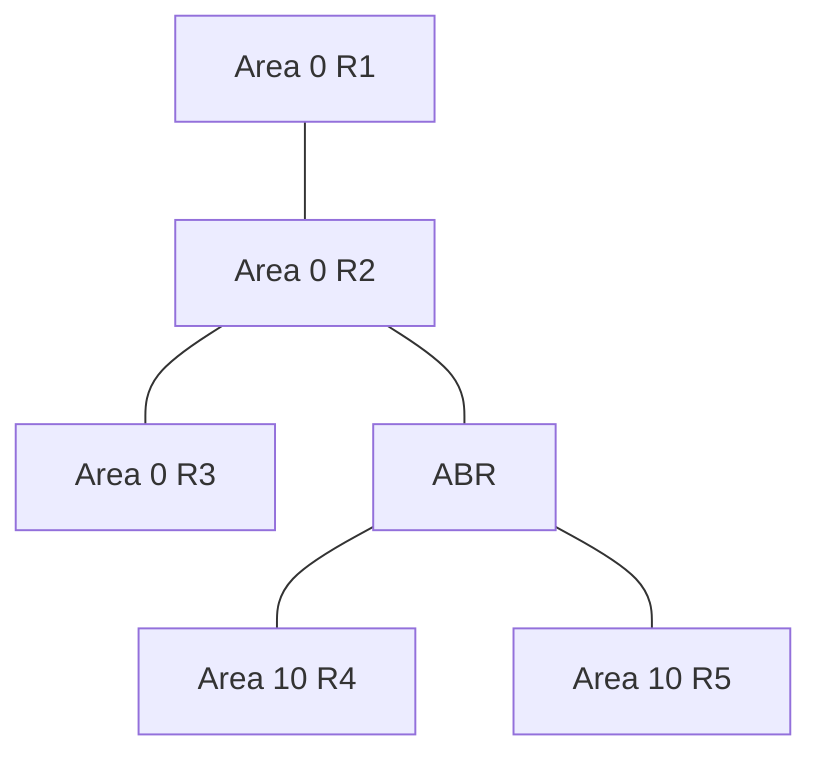

# OSPF 开放最短路径优先

## OSPF 是什么

OSPF 是链路状态 IGP。路由器把自己看到的链路状态发布给同一区域内其他路由器，所有路由器基于相同拓扑数据库计算最短路径树。

## 核心概念

| 概念 | 含义 |
|---|---|
| Area | 区域，用于缩小拓扑和控制泛洪范围 |
| Area 0 | 骨干区域，其他区域通常连接到 Area 0 |
| LSA | 链路状态通告 |
| LSDB | 链路状态数据库 |
| Cost | 路径代价，常与带宽相关 |
| DR/BDR | 广播网络中的指定路由器/备份 |

## 基本拓扑

## 工作过程

1. 发现邻居。
2. 建立邻接关系。
3. 交换 LSDB。
4. 运行 SPF 算法。
5. 生成路由表。
6. 链路变化时重新泛洪并计算。

## 区域设计

小型网络可以单区域。大型网络需要划分区域以减少 LSDB 和计算压力。常见特殊区域：

- Stub Area
- Totally Stubby Area
- NSSA

## 常见排障点

- Area ID 不一致。
- Hello/Dead Timer 不一致。
- MTU 不一致。
- 认证不一致。
- 网络类型不一致。
- 邻居卡在 ExStart/Exchange。

## 适用场景

- 企业园区网。
- 中小型数据中心 Underlay。
- 本地数据中心内部路由。

## 关联

- [[路由协议总览]]
- [[园区网三层架构]]
- [[ECMP 与等价多路径]]
- [[路由表、RIB 与 FIB]]

