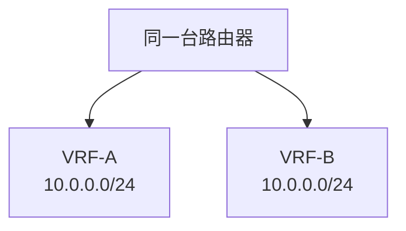

# VRF 与网络隔离

## VRF 是什么

VRF（Virtual Routing and Forwarding）让一台路由设备维护多张独立路由表。不同 VRF 中可以有相同 IP 地址而互不冲突。

## 基本图示

VRF-A 和 VRF-B 的 `10.0.0.0/24` 是两个不同上下文。

## 用途

- 多租户隔离。
- 管理网与业务网隔离。
- MPLS L3VPN 客户隔离。
- 云/数据中心中的逻辑路由隔离。
- 同一设备承载多个安全域。

## Route Leaking

VRF 之间默认不互通。如果需要共享服务，例如 DNS、NTP、堡垒机，需要配置 Route Leaking 或通过防火墙转发。

## 与 VLAN 区别

- VLAN 是二层隔离。
- VRF 是三层路由表隔离。

常见设计是 VLAN + VRF + 防火墙策略组合。

## 风险

- Route Leaking 配置错误会打破隔离。
- NAT、日志、监控要感知 VRF。
- 排障时必须确认你查的是哪张路由表。

## 关联

- [[路由表、RIB 与 FIB]]
- [[MPLS 与 Segment Routing]]
- [[公有云 VPC 通用拓扑]]
- [[防火墙、ACL 与安全域]]

