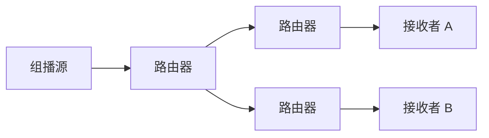

# 组播与 PIM 概览

## 组播是什么

组播让一个发送者把流量发给一组接收者，而不是分别给每个接收者发送一份。

适合：

- IPTV。
- 金融行情。
- 视频会议/直播分发内部网络。
- 数据中心特定服务发现。

## 单播、广播、组播

| 类型 | 说明 |
|---|---|
| 单播 | 一对一 |
| 广播 | 一对同一广播域所有 |
| 组播 | 一对多，接收者主动加入组 |

## IGMP 与 PIM

- IGMP：主机告诉本地路由器自己要加入哪个组播组。
- PIM：路由器之间建立组播转发树。

## 组播拓扑

## 常见模式

- PIM-SM：稀疏模式，常见。
- PIM-SSM：源特定组播，接收者指定源和组。
- PIM-DM：密集模式，较少用于现代大网。

## 新手注意

组播不是互联网默认随处可用的能力。跨三层、跨运营商、跨云使用组播通常需要特别支持或替代方案。

## 关联

- [[路由协议总览]]
- [[Ethernet 以太网]]
- [[IPv4 协议]]
- [[运营商接入网、城域网与骨干网]]

