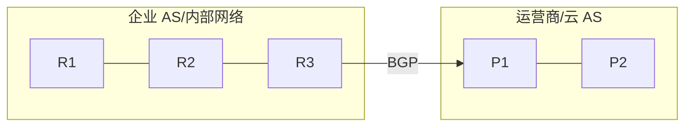

# 路由协议总览

## 路由协议解决什么

路由协议让路由器自动学习网络可达性。没有动态路由时，管理员需要手工维护大量静态路由。

## 分类

| 类型 | 协议 | 常见范围 |
|---|---|---|
| IGP | OSPF、IS-IS、RIP、EIGRP | 一个组织内部 |
| EGP | BGP | AS 之间，也常用于大型内部网络 |
| 静态 | 手工配置 | 小网络、默认路由、特殊路径 |

## IGP 与 EGP

IGP 关注一个自治域内部的快速收敛和最优路径。EGP 关注自治系统之间的可达性和策略。

AS 内部可能跑 OSPF/IS-IS；AS 之间跑 BGP。

## 常见选择

- 小型网络：静态路由 + 默认路由。
- 企业园区：OSPF 常见。
- 运营商骨干：IS-IS、BGP、MPLS 常见。
- 数据中心 Spine-Leaf：BGP 或 OSPF/IS-IS Underlay，EVPN BGP Overlay。
- 互联网：BGP。

## 路由协议关注的指标

- 邻居发现和保持。
- 路由传播。
- 度量值/Cost。
- 收敛时间。
- 环路避免。
- 路由过滤和汇总。
- 多路径 ECMP。
- 认证和安全。

## 学习建议

先理解 [[路由表、RIB 与 FIB]]、[[默认网关与下一跳]]、[[静态路由、默认路由与策略路由]]，再学 OSPF/IS-IS/BGP。

## 关联

- [[OSPF 开放最短路径优先]]
- [[IS-IS 路由协议]]
- [[BGP 边界网关协议]]
- [[ECMP 与等价多路径]]

