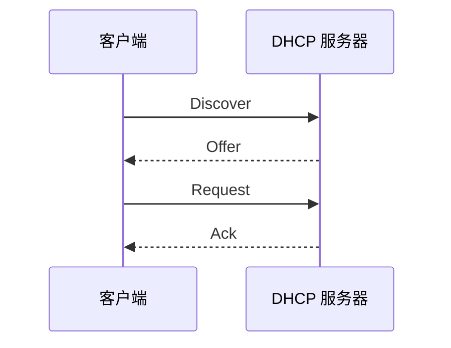

# DHCP 协议

## DHCP 做什么

DHCP 自动给终端分配网络参数：

- IP 地址。
- 子网掩码。
- 默认网关。
- DNS 服务器。
- 租期。
- 其他选项，例如 NTP、PXE。

## DORA 流程



## DHCP Relay

DHCP Discover 是广播，不能跨路由器。跨网段时需要 DHCP Relay：

```text
客户端 VLAN -> 三层网关 Relay -> DHCP 服务器
```

Relay 会把请求转成单播发给 DHCP 服务器，并携带来源接口信息。

## 租期

租期到期前，客户端会续租。如果 DHCP 不可用，已有地址可能还能用一段时间，但新设备无法正常入网。

## 常见问题

- 地址池耗尽。
- 网关或 DNS 选项错误。
- Relay 未配置或被 ACL 拦截。
- 非法 DHCP 服务器发错配置。
- 地址冲突。

## 关联

- [[局域网基础拓扑]]
- [[家庭与小型办公室 SOHO 拓扑]]
- [[IP 地址、子网与 CIDR]]
- [[ARP 与 IPv6 NDP]]

