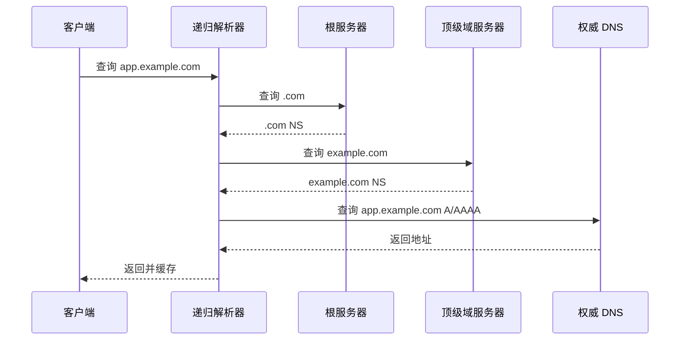

# DNS 协议

## DNS 做什么

DNS 把域名解析成地址或其他记录。它是互联网访问路径中的第一步之一。

## 查询链路

## 常见记录

| 记录 | 用途 |
|---|---|
| A | IPv4 地址 |
| AAAA | IPv6 地址 |
| CNAME | 别名 |
| MX | 邮件 |
| NS | 权威服务器 |
| TXT | 文本验证、SPF、DKIM 等 |
| SRV | 服务发现 |

## TTL

TTL 决定解析结果可缓存多久。TTL 太长，切换慢；太短，权威 DNS 压力更大。

## DNS 与流量调度

权威 DNS 可以根据来源返回不同地址，形成 [[DNS、GSLB 与 Anycast 调度]]。

## DNS 安全

- DNSSEC：验证 DNS 数据完整性和来源。
- DoH/DoT：加密客户端到递归解析器的 DNS 查询。
- 内网 Split-horizon DNS：同一域名内外返回不同地址。

## 关联

- [[DNS、GSLB 与 Anycast 调度]]
- [[端到端实例：局域网到公网再到对端局域网]]
- [[公有云 VPC 通用拓扑]]
- [[网络可观测性与排障工具]]

