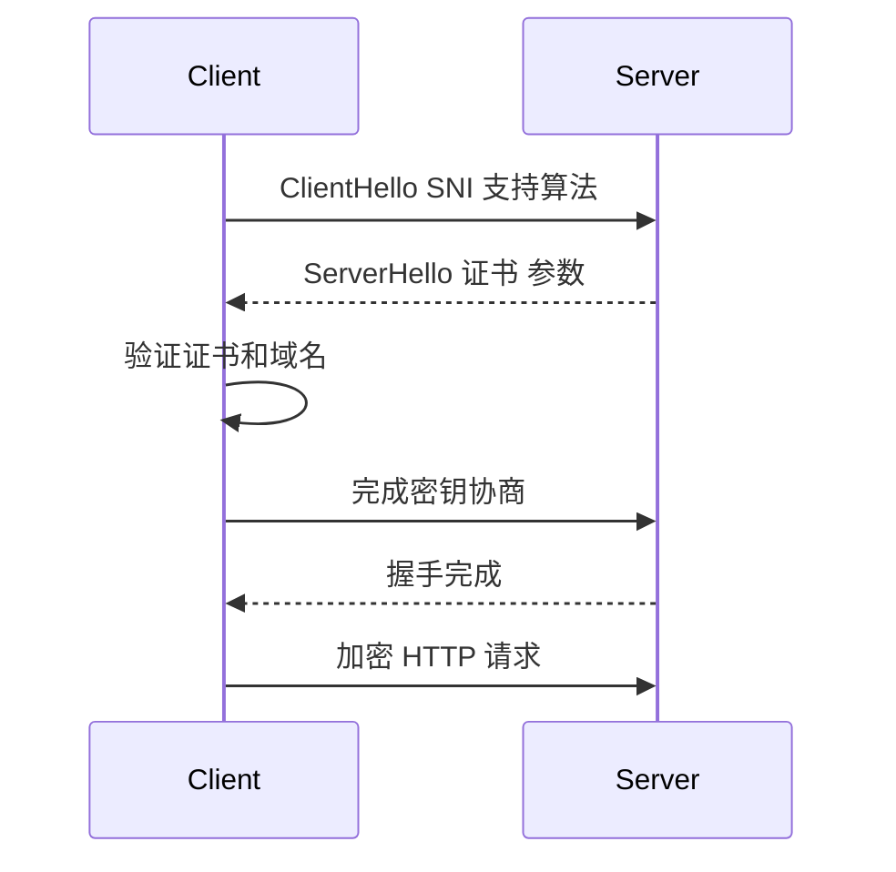

# TLS、HTTP 与 HTTPS

## HTTP

HTTP 是应用层协议，用于客户端和服务器交换请求/响应。

典型请求：

```text
GET /api/users HTTP/1.1
Host: app.example.com
```

## HTTPS

HTTPS 是 HTTP over TLS。TLS 提供：

- 服务器身份认证。
- 加密。
- 完整性保护。
- 可选客户端证书认证。

## TLS 握手简化



## SNI

SNI 让客户端在 TLS 握手中告诉服务器想访问哪个域名。这样同一个 IP 可以托管多个 HTTPS 站点。

## HTTP 版本

| 版本 | 传输 |
|---|---|
| HTTP/1.1 | TCP |
| HTTP/2 | TCP，多路复用 |
| HTTP/3 | QUIC/UDP |

## 入口设备上的 TLS

TLS 可能终止在：

- CDN。
- WAF。
- 负载均衡。
- 反向代理。
- 应用服务器。

如果 TLS 在入口终止，后端链路是否再加密是架构选择。

## 关联

- [[TCP、UDP 与 QUIC]]
- [[负载均衡 L4-L7]]
- [[代理、反向代理与 WAF]]
- [[端到端实例：局域网到公网再到对端局域网]]

