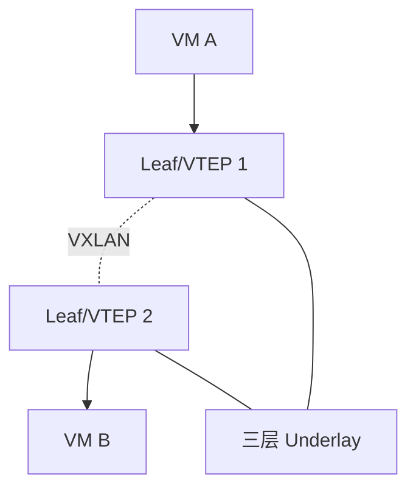

# VXLAN 与 EVPN

## VXLAN 是什么

VXLAN 把二层以太网帧封装进 UDP/IP 包，在三层网络上构建大规模二层 Overlay。

```text
内层 Ethernet 帧
-> VXLAN Header
-> UDP
-> 外层 IP
-> 外层 Ethernet
```

## VNI

VXLAN 使用 VNI 标识虚拟网络。VNI 类似“更大规模的 VLAN ID”，可支持更多租户和网络。

## VTEP

VTEP 是 VXLAN 隧道端点，负责封装和解封装。它可以在物理交换机、虚拟交换机、云主机或网关中。

## EVPN

EVPN 常用 BGP 作为控制平面，传播 MAC、IP、VTEP、前缀等信息，避免纯泛洪学习带来的问题。

## 典型数据中心



## 常见用途

- 数据中心多租户。
- 跨机架二层扩展。
- 云网络 Overlay。
- Kubernetes CNI Overlay。

## 注意点

- Underlay 必须稳定可达。
- MTU 要考虑 VXLAN 额外头部。
- EVPN 路由类型和网关设计较复杂。
- 排障要同时看内层 MAC/IP 和外层 VTEP IP。

## 关联

- [[Overlay 与 Underlay]]
- [[Spine-Leaf 数据中心拓扑]]
- [[BGP 边界网关协议]]
- [[Kubernetes 网络拓扑]]

