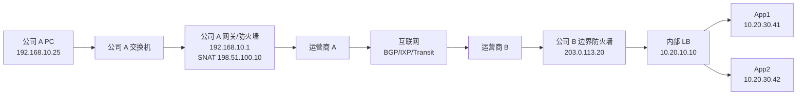
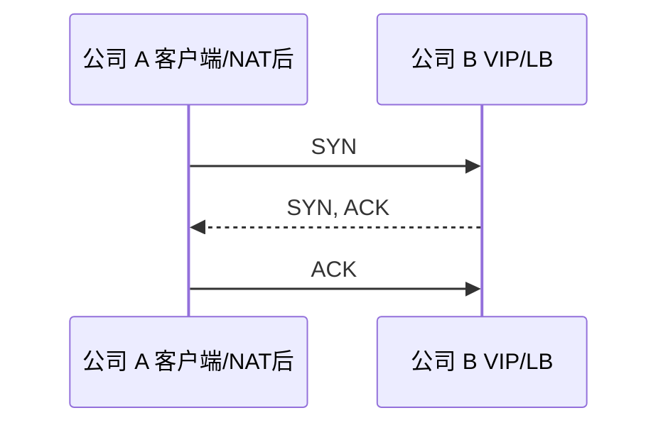
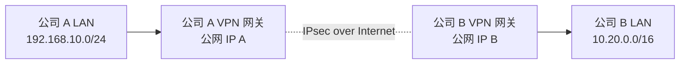

# 端到端实例：局域网到公网再到对端局域网

## 场景

公司 A 办公网中的电脑访问公司 B 发布在公网入口后的内部 Web 服务。

```text
公司 A 客户端：192.168.10.25/24
公司 A 网关：192.168.10.1
公司 A 出口公网 IP：198.51.100.10

访问域名：app.b.example
DNS 返回公司 B 公网 VIP：203.0.113.20

公司 B 边界公网 VIP：203.0.113.20:443
公司 B 内部负载均衡：10.20.10.10
公司 B 应用服务器：10.20.30.41、10.20.30.42
```

示例地址 `198.51.100.0/24`、`203.0.113.0/24` 属于文档示例地址，真实环境会换成实际公网地址。

## 总体拓扑



## 第 0 步：客户端入网

如果公司 A 使用 DHCP，电脑开机后先获取网络参数：

1. DHCP Discover：客户端广播寻找 DHCP 服务器。
2. DHCP Offer：服务器提供地址。
3. DHCP Request：客户端请求使用该地址。
4. DHCP Ack：服务器确认。

客户端得到：

```text
IP: 192.168.10.25
Mask: 255.255.255.0
Gateway: 192.168.10.1
DNS: 192.168.1.53 或公共/企业 DNS
```

涉及协议：[[DHCP 协议]]、[[Ethernet 以太网]]。

## 第 1 步：DNS 解析

用户访问：

```text
https://app.b.example/
```

客户端需要先得到 IP：

1. 浏览器/系统查本地 DNS 缓存。
2. 若无缓存，向递归 DNS 查询。
3. 递归 DNS 查询根、TLD、权威 DNS，或命中缓存。
4. 权威 DNS 返回 `203.0.113.20`。

如果公司 B 使用 GSLB/CDN，DNS 可能按用户位置、运营商、健康状态返回不同入口。

涉及协议：[[DNS 协议]]、可能涉及 [[DNS、GSLB 与 Anycast 调度]]。

## 第 2 步：客户端判断目的是否本地

客户端比较：

```text
本机：192.168.10.25/24
目的：203.0.113.20
```

目的不在 `192.168.10.0/24`，所以要发给默认网关 `192.168.10.1`。

涉及知识：[[IP 地址、子网与 CIDR]]、[[默认网关与下一跳]]。

## 第 3 步：ARP 找默认网关 MAC

客户端需要把 IP 包放进以太网帧。跨网段时，以太网目的 MAC 是默认网关 MAC。

如果 ARP 缓存没有 `192.168.10.1`：

```text
PC -> 广播：Who has 192.168.10.1?
网关 -> 单播：192.168.10.1 is at 00:11:22:33:44:55
```

然后客户端发送：

```text
以太网：
  源 MAC = PC MAC
  目的 MAC = 网关 MAC
IP：
  源 IP = 192.168.10.25
  目的 IP = 203.0.113.20
TCP：
  源端口 = 临时端口 51532
  目的端口 = 443
```

涉及协议：[[ARP 与 IPv6 NDP]]、[[Ethernet 以太网]]、[[IPv4 协议]]、[[TCP、UDP 与 QUIC]]。

## 第 4 步：公司 A 出口防火墙检查和 SNAT

公司 A 防火墙收到包后：

1. 查路由表，目的 `203.0.113.20` 匹配默认路由，下一跳是运营商。
2. 检查安全策略：办公网是否允许访问公网 TCP/443。
3. 建立会话状态。
4. 做 SNAT/PAT：

```text
NAT 前：
192.168.10.25:51532 -> 203.0.113.20:443

NAT 后：
198.51.100.10:40001 -> 203.0.113.20:443
```

防火墙记录 NAT 表和会话表，等待回包。

涉及知识：[[防火墙、ACL 与安全域]]、[[NAT、PAT 与 CGNAT]]、[[路由表、RIB 与 FIB]]。

## 第 5 步：进入运营商和互联网

公司 A 出口把包交给运营商 A。运营商 A、骨干网、IXP/Transit、运营商 B 之间通过路由表逐跳转发。

公网中关键是目的 IP `203.0.113.20`。各 AS 通过 BGP 学到：到达 `203.0.113.0/24` 或更具体前缀应该往哪个邻居走。

每一跳可能发生：

- 以太网/光传输重新封装。
- MPLS 标签压入/交换/弹出。
- TTL 减一。
- ECMP 哈希选择一条等价路径。
- QoS 排队。
- 运营商 ACL 或 DDoS 清洗检查。

一般不会发生：

- 中间路由器不会看完整 HTTP 内容。
- 中间路由器不会知道最终内网服务器 `10.20.30.41`。
- 中间公网路由器通常不会保留每条 TCP 连接状态。

涉及知识：[[互联网宏观拓扑]]、[[自治系统 AS 与 ASN]]、[[BGP 边界网关协议]]、[[IXP、Peering 与 Transit]]、[[MPLS 与 Segment Routing]]、[[ECMP 与等价多路径]]。

## 第 6 步：到达公司 B 公网边界

包到达公司 B 边界：

```text
198.51.100.10:40001 -> 203.0.113.20:443
```

公司 B 可能有几种发布方式：

### 方式 A：边界防火墙 DNAT 到内部 LB

```text
203.0.113.20:443 -> DNAT -> 10.20.10.10:443
```

防火墙检查策略，确认允许公网访问该 VIP 的 443，再把目的地址改成内部负载均衡。

### 方式 B：公网负载均衡直接持有 VIP

公网 VIP 属于负载均衡，负载均衡接收连接后转发给后端。

### 方式 C：CDN/WAF 先接入

用户可能先到 CDN/WAF，再由 CDN/WAF 回源到公司 B。这种情况下公司 B 看到的源 IP 可能是 CDN/WAF 节点，需要通过 Header 或代理协议传递真实客户端 IP。

本例采用方式 A。

涉及知识：[[NAT、PAT 与 CGNAT]]、[[防火墙、ACL 与安全域]]、[[负载均衡 L4-L7]]、[[代理、反向代理与 WAF]]。

## 第 7 步：负载均衡选择后端

内部 LB 收到连接，选择一台后端：

```text
10.20.10.10 -> 10.20.30.41
```

选择依据可能是：

- 轮询。
- 最少连接。
- 权重。
- 源 IP 哈希。
- Cookie 会话保持。
- 后端健康检查结果。

如果 LB 做 TLS 终止：

```text
客户端 --TLS--> LB --HTTP/HTTPS--> App
```

如果 LB 做四层转发：

```text
客户端 --TCP/TLS 透传--> App
```

涉及知识：[[负载均衡 L4-L7]]、[[TLS、HTTP 与 HTTPS]]。

## 第 8 步：TCP 三次握手

若使用 HTTPS over TCP：



注意：客户端本机以为源地址是 `192.168.10.25:51532`，公司 B 看到的源地址通常是公司 A 出口 NAT 后的 `198.51.100.10:40001`。

涉及协议：[[TCP、UDP 与 QUIC]]。

## 第 9 步：TLS 握手

TCP 建立后进行 TLS：

1. ClientHello：包含 SNI `app.b.example`、支持算法、随机数。
2. ServerHello：选择算法，返回证书。
3. 客户端验证证书链、域名、有效期。
4. 双方协商会话密钥。
5. 后续 HTTP 加密传输。

如果公司 B 使用 WAF/CDN/LB 终止 TLS，那么证书在这些入口设备上；如果端到端 TLS，则应用服务器也需要证书。

涉及协议：[[TLS、HTTP 与 HTTPS]]。

## 第 10 步：HTTP 请求与响应

客户端发送加密后的 HTTP 请求：

```text
GET / HTTP/1.1
Host: app.b.example
```

应用服务器处理后返回响应。返回路径大体相反：

```text
App -> LB -> 公司 B 防火墙 -> 互联网 -> 公司 A 出口防火墙 -> PC
```

公司 A 出口防火墙根据之前的 NAT 表：

```text
203.0.113.20:443 -> 198.51.100.10:40001
改回：
203.0.113.20:443 -> 192.168.10.25:51532
```

然后发回客户端。

## 第 11 步：连接关闭或复用

TCP 连接可能：

- HTTP/1.1 keep-alive 复用。
- HTTP/2 在一个 TCP 连接上多路复用多个请求。
- TLS 会话恢复减少下次握手成本。
- 空闲超时后由客户端、服务器或中间设备关闭。

## 如果使用 HTTP/3/QUIC

路径类似，但 L4 变成 UDP/443：

- 没有 TCP 三次握手。
- QUIC 内部完成连接建立和 TLS 1.3。
- NAT/防火墙仍需要维护 UDP 会话状态。
- UDP 超时通常比 TCP 短，需要 keepalive 或应用层处理。

涉及协议：[[TCP、UDP 与 QUIC]]。

## 如果是站点到站点 VPN 访问对端内网

另一种常见“局域网到公网再到对端局域网”是 IPsec VPN：



此时内层包可能是：

```text
192.168.10.25 -> 10.20.30.41
```

外层包是：

```text
公网 IP A -> 公网 IP B
```

中间互联网只转发加密后的外层包，看不到内层私网地址和应用内容。

涉及协议：[[IPsec、WireGuard 与隧道]]、[[混合云、专线与 VPN]]。

## 最容易出问题的位置

- DNS 返回了错误入口。
- 客户端网关/掩码错误。
- ARP/NDP 不正常。
- 公司 A 防火墙未放行出站。
- NAT 端口耗尽或会话超时。
- 运营商互联路径拥塞。
- 公司 B 防火墙 DNAT 或策略错误。
- LB 健康检查误判。
- TLS 证书域名不匹配。
- 回程路由不一致。
- MTU/PMTUD 问题。

## 一句话总结

这条流量不是“电脑直接连到了对端内网服务器”，而是每一层都完成自己的任务：DNS 找入口，主机找网关，二层找 MAC，三层逐跳路由，边界设备做 NAT 和安全检查，互联网靠 BGP 到达对端，负载均衡选择后端，TLS/HTTP 完成应用通信。

